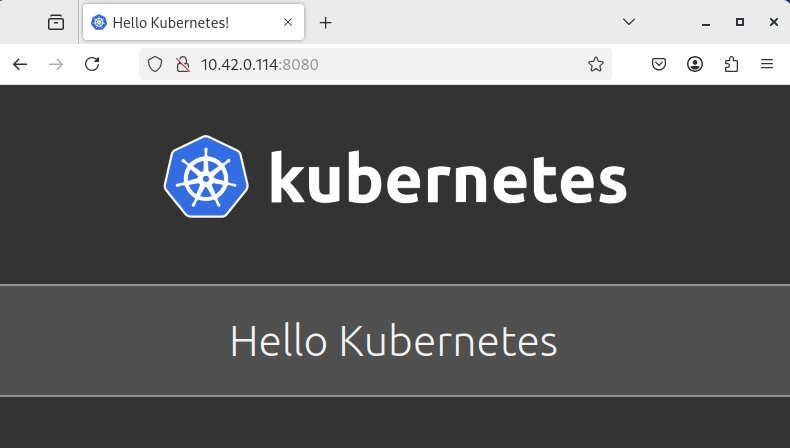

## Introduction
[K3s](https://k3s.io/) is a lightweight version of Kubernetes. It is easy to install and requires only half the memory of Kubernetes, making it suitable for resource-constrained environments, especially for use cases like edge computing, IoT, and others.

## Deployment Guide

### Prepare the Environment
First, ensure that the network of the cluster is working correctly and that it can access the internet. You can SSH into each machine in the cluster to execute the subsequent installation commands. Make sure that the IP addresses of the master node and worker nodes are fixed, and that they can access each other over the network.

###  Install K3s (Master Node)
The installation of K3s is very simple. Just run the following command on the master node:
``` bash
curl -sfL https://get.k3s.io | sh -
```
If the download is slow, you can speed up the installation by using the following command:
``` bash
curl -sfL https://rancher-mirror.rancher.cn/k3s/k3s-install.sh | INSTALL_K3S_MIRROR=cn sh -
```
This command will automatically download and install K3s. After the installation is complete, check if the K3s service is running with the following command:
``` bash
sudo systemctl status k3s
```
If it shows `active (running)`, K3s has started successfully.

```bash
sudo systemctl status k3s
● k3s.service - Lightweight Kubernetes
     Loaded: loaded (/etc/systemd/system/k3s.service; enabled; preset: enabled)
     Active: active (running) since Mon 2025-02-17 12:07:15 CST; 3h 38min ago
       Docs: https://k3s.io
    Process: 8803 ExecStartPre=/bin/sh -xc ! /usr/bin/systemctl is-enabled --quiet nm-cloud-setup.service 2>/dev/null (code=exited, status=0/SUCCESS)
    Process: 8805 ExecStartPre=/sbin/modprobe br_netfilter (code=exited, status=0/SUCCESS)
    Process: 8808 ExecStartPre=/sbin/modprobe overlay (code=exited, status=0/SUCCESS)
   Main PID: 8810 (k3s-server)
      Tasks: 32
     Memory: 583.2M
        CPU: 29min 49.755s
     CGroup: /system.slice/k3s.service
             ├─8810 "/usr/local/bin/k3s server"
             └─8895 "containerd "
```

### Install K3s (Worker Nodes)
When installing K3s on the worker nodes, you need to connect them to the master node. Run the following command on the worker node to install K3s:
``` bash
curl -sfL https://get.k3s.io | K3S_URL=https://<MasterNodeIP>:6443 K3S_TOKEN=<MasterNodeToken> sh -
```
In the command above, replace `主节点IP` with the master node's IP address, and `MasterNodeIP` with the token obtained from the master node. You can retrieve the token by running the following command on the master node:
```bash
sudo cat /var/lib/rancher/k3s/server/node-token
```
After installation is complete, verify that the worker node has successfully joined the cluster by running:
```bash
sudo kubectl get nodes
```
If the worker node appears in the list with a status of `Ready`, it means the worker node has successfully joined the cluster.

```bash
sipeed@lpi3h-a2d1:~$ sudo kubectl get nodes
NAME         STATUS   ROLES                  AGE     VERSION
lpi3h-1967   Ready    <none>                 20h   v1.31.5+k3s1
lpi3h-231e   Ready    <none>                 20h   v1.31.5+k3s1
lpi3h-4782   Ready    <none>                 56m   v1.31.5+k3s1
lpi3h-a2d1   Ready    control-plane,master   23h   v1.31.5+k3s1
lpi3h-ba13   Ready    <none>                 19h   v1.31.5+k3s1
lpi3h-c06b   Ready    <none>                 21h   v1.31.5+k3s1
```

### Deploy an Application
We will create a configuration file to run a K3s container.

```bash
nano hello-kubernetes.yaml
```
The file content is as follows:
```yaml
apiVersion: apps/v1
kind: Deployment
metadata:
  name: hello-kubernetes
spec:
  replicas: 1
  selector:
    matchLabels:
      app: hello-kubernetes
  template:
    metadata:
      labels:
        app: hello-kubernetes
    spec:
      containers:
      - name: hello-kubernetes
        image: paulbouwer/hello-kubernetes:1.10.1
        env:
        - name: MESSAGE
          value: "Hello Kubernetes"
```
Then, use this configuration file to start a container:

```bash
sudo kubectl apply -f hello-kubernetes.yaml
```
Check the status of the pods:

```bash
sudo kubectl get pods -o wide
NAME                                READY   STATUS    RESTARTS   AGE     IP            NODE   NOMINATED NODE   READINESS GATES
hello-kubernetes-7fbb7f4899-zqs5x   1/1     Running   0          2m39s   10.42.0.114   arch   <none>           <none>
```

Finally, access the application via a browser at 10.42.0.114:8080

