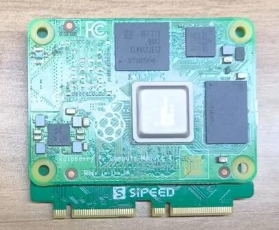
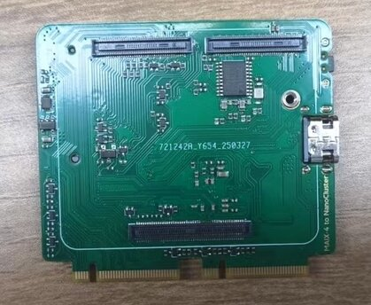
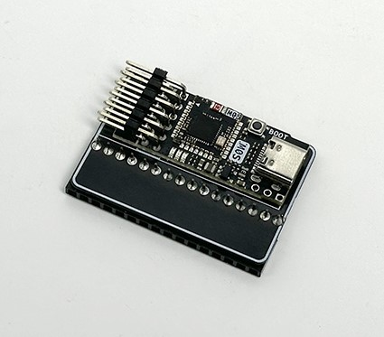
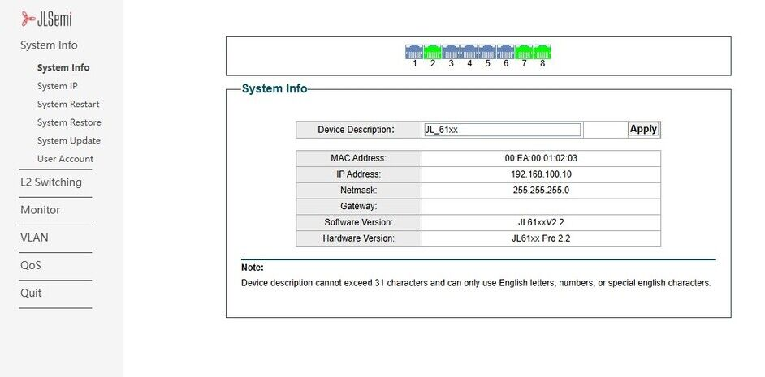

## Hardware Installation

### LM3H Installation

First, attach the heatsink to the main control chip to improve heat dissipation. When installing the core board, ensure the correct orientation to avoid damaging the device.


Align the notch on the gold fingers of the core board with the slot on the mainboard. Gently place it in position and press down evenly until you hear a "click" sound, confirming that the core board is securely inserted without tilting or loosening.


To remove the core board, hold both sides of the board evenly with both hands and gently pull upward. Avoid applying excessive force to one side, as this may cause damage. If the core board is tightly fitted, slightly wiggle it left and right before pulling it out. Do not pull it out forcefully to prevent damage to the gold fingers or the mainboard slot.

### CM4 and CM5 Installation

- First, install the CM4 / CM5 module onto the adapter board


- Then insert the adapter board into the mainboard slot



>If you are using **CM5** and require **USB3.0**, make sure to leave one slot empty between modules to ensure proper USB 3.0 functionality.

### M4N Installation

- First, install the M4N core module onto the adapter board



- Then insert the adapter board into the mainboard slot


### Fan Installation

Align the fan with the reserved mounting holes on the baseboard:


Make sure the fan is facing the correct direction — the airflow should point toward the Ethernet port to better dissipate heat from the SOM:


Secure the fan firmly to the baseboard using screws:


Connect the fan's power cable to the fan power connector on the baseboard.
Please ensure the correct plug orientation — the red wire should be connected to the positive terminal:


## Power Supply

NanoCluster supports both USB-C PD and PoE power input, with dual hot-plug capability — you can connect both PD and PoE at the same time, and the system will remain stable even if one source is disconnected. Either power source can be plugged or unplugged at any time.

By default, the system supports 60W (20V/3A) PD input, and up to 65W (20V/3.25A) when using e-Marker USB-C cables. We recommend using the included PD adapter and high-quality USB-C cables to ensure stable power delivery. An optional 60W peak / 50W sustained PoE module is available for deployments where dedicated power access is limited.

### Max Supported Configurations (Based on Power Budget):

| Power Source | Max Supported SOMs                |
|--------------|-----------------------------------|
| PD           | 7× LM3H / CM4 / CM5 / M4N         |
| PoE          | 7× LM3H / CM4; 6× CM5 / M4N       |
| SSD Installed| Up to 4× SOMs with SSDs (space-limited) |

<br>

> **Note:** CM5 and M4N modules have higher power consumption. When using PoE, it is recommended to connect no more than 6 of these.

---

### PD Port Description

The board supports USB-C PD power input, with a maximum of 65W. Please use the official adapter or a third-party adapter rated at 20V/3A or higher to ensure reliable operation under full load.


---

### PoE Module Installation

NanoCluster supports an optional PoE module for power-over-Ethernet deployment, helping simplify wiring. Please follow the diagrams below for proper installation:


Align the PoE module with the mainboard socket and insert carefully. Ensure a firm and secure connection.


> Use a PoE switch or adapter compliant with standard protocols to ensure safety and stability.

## Flashing the Image

##### The core board comes with a pre-installed system. If you need to reflash the system, follow the steps below:

### LM3H Flashing

Download the required firmware image and prepare a computer that supports USB OTG along with a USB cable. The NanoCluster currently uses images compatible with the Longan Pi 3H, which can be downloaded here: [Click to Download](https://wiki.sipeed.com/hardware/en/longan/h618/lpi3h/3_images.html).

Insert the core board into the Slot1 position, then use a USB cable to connect the mainboard's OTG interface (the lower port) to the computer. Press and hold the BOOT button, then power on or reset the device to enter UMS flashing mode.


Once the firmware image is ready, open balenaEtcher, select the image file to be flashed, and ensure the core board is recognized as a USB drive. In balenaEtcher, choose the target device, click the "Flash" button to start the flashing process, and wait for it to complete. Safely eject the device, disconnect the USB cable, and restart the device to boot into the new system.


### CM4/CM5 Flashing

1. Install the `rpiboot` tool following the [official documentation](https://www.raspberrypi.com/documentation/computers/compute-module.html#set-up-the-host-device).

2. Press and hold the BOOT button on the adapter board, then connect the USB OTG port to your host computer.

3. Once the host detects a **BCM2711 (BCM2712) Boot** device, run `rpiboot`. After a few seconds, a USB drive will automatically appear.

4. Open the [Raspberry Pi Imager](https://www.raspberrypi.com/software/), select the desired image, and flash it to the detected device.

### M4N Flashing

You can refer to the [System Flashing Guide](https://wiki.sipeed.com/hardware/zh/maixIV/m4ndock/system-update.html) for the flashing process.

## Remote Management

The mainboard is equipped with an Ethernet port for connecting to a switch. Devices within the cluster are interconnected through the switch and can be controlled and managed via their IP addresses.

**How to obtain the device's IP address (using the LM3H module as an example)**:

First, connect the Ethernet cable to the mainboard's port, then power on the device. The pre-installed firmware has mDNS service enabled. On your PC, enable the Avahi service and use mDNS to scan the entire network to retrieve the mDNS domain name information of the lpi3h device.

```bash
avahi-browse -art | grep lpi3h
```

Then use the following command:

```bash
ssh sipeed@lpi3h-xxxx.local
```

to connect (replace `xxxx` with the hostname obtained using the `avahi-browse` command).

> lpi3h is the default mDNS hostname prefix for LM3H. If you are using CM4 or CM5, please adjust the hostname according to the system image you have flashed.

## Serial Connection

Each SOM exposes the system serial port to a 2.54mm header, which can be connected for debugging using a serial-to-USB module.

If you need to debug or control multiple slots simultaneously, we recommend using the USB to four serial ports expansion board we provide. This expansion board consolidates the serial signals from slot3, slot5, slot6, and slot7 into the USB interface of slot1, making it easier to manage and operate centrally.



## Power Control  

The reset pins for slots 1~7 are controlled by slot 1 through **I2C extended IO**, enabling remote power on/off functionality.  

**LM3H Control Method Example:**

```bash
# Reset the switch chip (GPIO 0)
sudo gpioset gpiochip2 0=0 && sudo gpioset gpiochip2 0=1

# Reset slot2 (LM3H)
# Hold for 8 seconds to power off
sudo gpioset gpiochip2 2=0 && sleep 8 && sudo gpioset gpiochip2 2=1

# Quick trigger to power on
sudo gpioset gpiochip2 2=0 && sleep 1 && sudo gpioset gpiochip2 2=1

# Reset slot2 (CM4/CM5)
sudo gpioset gpiochip2 2=0 && sudo gpioset gpiochip2 2=1
```

> `gpiochip2` refers to the GPIO controller index. `x=0` sets the IO with index `x` to low level, while `x=1` sets it to high level.

| GPIO Index | Function          |
|------------|-------------------|
| 0          | Switch chip reset |
| 1~7        | slot1~slot7 reset |

**CM4/CM5 Control Method Example:**

todo。

## Fan Speed Adjustment

LM3H / CM4 / CM5 all support fan speed control. By default, LM3H automatically adjusts fan speed based on CPU temperature, while the official images of CM4 and CM5 run the fan at full speed. Below are the control methods for each platform.

If you want to manually control the fan, you can connect to the slot1 device via SSH and execute the following commands:

### LM3H Fan Control

``` bash
echo disabled | sudo tee /sys/class/thermal/thermal_zone2/mode

echo 4 | sudo tee /sys/class/thermal/cooling_device0/cur_state
```

The value of `cur_state` ranges from 0 to 4, representing different fan speeds.

To restore automatic control, use the following command:

``` bash
echo enabled | sudo tee /sys/class/thermal/thermal_zone2/mode
```

### CM4 Fan Control

Add the following line to /boot/config.txt:

```bash
dtoverlay=pwm-2chan,pin=12,func=4,pin2=13,func2=4
```

After rebooting, execute:

``` bash
sudo pigpiod
```

Control the fan using Python:

```python
import pigpio

pi = pigpio.pi()

# Set PWM frequency and range
pi.set_PWM_frequency(13, 50)
pi.set_PWM_range(13, 200)

# Set fan speed
pi.set_PWM_dutycycle(13, 0)     # Off
pi.set_PWM_dutycycle(13, 200)   # Full speed
```

### CM5 Fan Control

Control the fan using Python:
```python
import RPi.GPIO as GPIO

GPIO.setmode(GPIO.BCM)
GPIO.setup(13, GPIO.OUT)

pwm = GPIO.PWM(13, 50)  # 50Hz frequency
pwm.start(0)            # Off
pwm.start(100)          # Full speed
```

## Switch Management

### Introduction

NanoCluster is equipped with the JL6108 Gigabit switch chip, which is based on the **RISC-V** architecture. It can be used as a plug-and-play switch or as a locally managed Layer 2 switch, supporting configuration via a web interface. Its main features include:

- **System Management**: Displays system information, supports reboot, factory reset, and firmware upgrades
- **Network Configuration**: Supports static IP and DHCP dynamic IP configuration
- **Port Management**: Enables/disables ports, configures link speed, and manages flow control
- **Port Aggregation**: Supports port binding to increase bandwidth utilization
- **Security and Isolation**: Port isolation to prevent data leakage
- **Traffic Monitoring**: Port MIB statistics and traffic analysis
- **Loop Protection**: Prevents network loops to enhance stability
- **VLAN Configuration**: Supports MTU VLAN, port-based VLAN, 802.1Q VLAN, and PVID settings
- **QoS Configuration**: Manages traffic priority based on port, PCP, and DSCP
- **Bandwidth and Storm Control**: Supports port-based bandwidth limitation and broadcast storm suppression

### User Guide

#### Logging into the Web Management Interface

1. **Ensure Device Connection**  
   Make sure the NanoCluster is powered on and connected to the management host via an Ethernet cable.

2. **Configure IP Address**  
   The switch's default IP address is **10.10.11.10/24**. Ensure the management host has an IP in the same subnet, e.g., **10.10.11.x** (where x is between 1-254 but not 10), with a subnet mask of **255.255.255.0**.  

   

3. **Access the Management Interface**  
   Open a browser and enter `http://10.10.11.10`, then press Enter to reach the login page.  

   

4. **Login to the Management System**  
   Enter the **admin username and password** (both default to `admin`), then click **Login** to access the main interface.  

   

### Basic Configuration

#### Port Management
The JL6108 switch provides port status management, supporting **port enable/disable**, **speed configuration**, and **flow control**.
- **Enable/Disable Ports**: Navigate to the **Port Management** page, select the desired port, and enable or disable it.  
- **Modify Port Speed**: Supports 10Mbps / 100Mbps / 1000Mbps modes.  
- **Flow Control**: Can be enabled to prevent packet loss.  


#### VLAN Configuration
VLAN (Virtual Local Area Network) is used to segment different network areas, prevent broadcast storms, and enhance security.

##### Configuring Port VLAN

1. **Access the Port VLAN Page**  
   Navigate to `VLAN` >> `Port VLAN` in the Web interface.

2. **Enable Port VLAN**  
   Check the **"Enable Port VLAN"** option and click **`Apply`**.

3. **Create VLAN 2 and Assign Ports**  
   - Enter **`2`** in the **VLAN ID** field  
   - Select **Ports 2 to 4**  
   - Click **`Apply`** to save the configuration  

4. **View the Port Member Table**  
   After configuration, **Ports 2-4 will be automatically removed from VLAN 1** and assigned to VLAN 2.   

   

#### QoS Configuration (Traffic Prioritization)
QoS ensures stable performance for high-priority traffic such as video conferencing and VoIP:
1. **Navigate to "QoS Settings"**  
2. Select **Port-Based / 802.1P / DSCP** QoS strategy  
3. Set **High / Medium / Low Priority Queues**  
4. **Save the settings** to apply the QoS rules    


### Additional Configuration

The JL6108 switch also supports more advanced features. For detailed configuration instructions, please refer to the official manual.

[Click here to view the full manual](https://dl.sipeed.com/shareURL/Cluster/NanoCluster/06_Switch_JL6108)

We provide the **JL6108 SDK** based on the **RISC-V** architecture. Users can download the SDK and develop independently from the following link:

[JL6108 SDK](https://dl.sipeed.com/shareURL/Cluster/NanoCluster/06_Switch_JL6108)

## FAQ (Troubleshooting)

### Device Won't Power On / Can't Boot into System
Ensure you are using a power adapter that supports at least PD 20V output. Avoid using USB power from a host device, as this may prevent the device from starting properly. Check if the green indicator light near the power input interface is lit. If there is no response, the issue may lie with the power adapter or power cable. Observe the blue power indicator lights corresponding to each slot to determine if the system has started normally.

If **LM3H** fails to boot into the system, press and hold the BOOT button while powering on or resetting the device to check if it enters UMS mode. Confirm whether the device is recognized as a USB drive in disk management. If the system is damaged or cannot boot, you can reflash the [firmware image](https://wiki.sipeed.com/hardware/en/NanoCluster/use.html#Flashing-the-Image). If UMS mode cannot be entered, try the [emergency flashing](https://wiki.sipeed.com/hardware/en/cluster/NanoCluster/use.html#Emergency-Flashing-%28LM3H%29) method.

If **CM4/CM5** fails to start normally, you can re-flash the system image following the instructions in the [firmware image](https://wiki.sipeed.com/hardware/en/cluster/NanoCluster/use.html#Flashing-the-Image) section and test again.

### Network Connection Issues (Unable to Obtain IP)
If the system boots successfully but there are network connection issues or the device cannot obtain an IP address, ensure the Ethernet cable is connected before powering on the device. Switches detect network interfaces when the device powers on. Plugging in the Ethernet cable after powering on may cause the interface to fail to recognize the connection.

### Emergency Flashing (LM3H)

If U-Boot is corrupted and the device cannot enter UMS mode, you can manually recover it using FEL mode. Use the `sunxi-fel` or `xfel` tools to load U-Boot into memory and start UMS mode, then proceed with flashing.

#### Entering FEL Mode

Short the specified pin on slot1 to GND, then power on the device to enter FEL mode (future versions may add button control).


#### Using sunxi-fel

Install and compile:
```bash
git clone https://github.com/linux-sunxi/sunxi-tools.git
cd sunxi-tools
make tools
sudo make install
```

Flash U-Boot:
```bash
sudo sunxi-fel uboot /path/u-boot-sunxi-with-spl.bin
```

After completing the process, the device should enter UMS mode successfully, allowing you to proceed with flashing the system image.

#### Using xfel

Install and compile:
```bash
sudo apt install libusb-1.0-0-dev
git clone https://github.com/xboot/xfel.git
cd xfel
make
sudo make install
```

Flash U-Boot:
```bash
xfel ddr lpddr4
xfel write 0x4a000000 /path/u-boot-dtb.bin
xfel exec 0x4a000000
```

After completing the process, the device should enter UMS mode successfully, allowing you to flash the system image.
