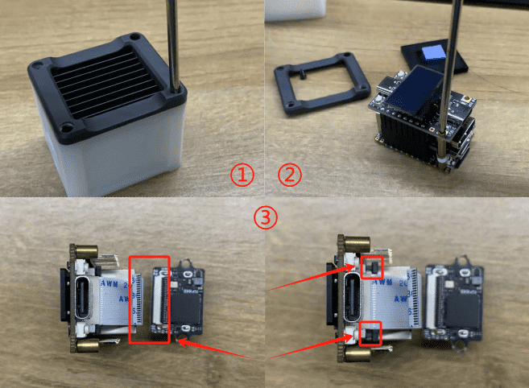

## Abnormal repair
+ Unable to obtain IP address
    1. Lite users need check if there is a card inserted. The Lite version is shipped without a card by default and requires users to bring their own TF card. Follow [here]（ https://wiki.sipeed.com/hardware/zh/kvm/NanoKVM/system/flashing.html ）Please retry after burning the card;
    2. Check if the network switch supports 100M connection. Some new switches do not support 100M connection. Please replace the switch and try again
    3. Try replacing the power supply, some power supplies may cause NanoKVM to not obtain IP or affect network speed
+ After logging into the browser interface, there is no screen
    1. Ensure that HDMI has an output signal and unplug and plug the HDMI cable again
    2. Enter the web terminal and execute `/etc/init.d/S95nanokvm restart` to restart the service.
    3. If the above methods cannot restore normal operation, click on the "Check for Updates" button on the interface to update the application
    4. The early internal testing version of Full NanoKVM used a regular ribbon cable to connect to the HDMI acquisition board, which may not detect HDMI signals due to poor contact. It can be disassembled as shown in the following figure and reconnected to the ribbon cable
    
+ OLED displays information normally, but cannot open web pages
    1. Reference [here](https://wiki.sipeed.com/hardware/zh/kvm/NanoKVM/system/updating.html#%E8%8E%B7%E5%8F%96-IP) Connection Development Board
    2. Enter the command `rm /etc/kvm/server.yaml`
    3. Execute `reboot` to restart the system
+ Early beta version of Full NanoKVM ATX small board connected to the host RESET pin. When restarting NanoKVM, the host may be restarted. Please disconnect the RESET jumper
+ Early beta version of Full NanoKVM had a current backflow issue: when the host was turned off and there was no power output from the USB, the current would backflow into the host when connected to an auxiliary power supply
    1. Firstly, it is recommended to set the USB to maintain power supply after the host is turned off
    2. Full version users: Use an electric soldering iron to disconnect the 5V resistor or pin short-circuit at the position shown in the figure, and only use the auxiliary power supply port for power supply
    
+ Attempt to power off and restart to solve unknown issues
+ If there are abnormal situations such as network disconnection during the update process, it may cause the update to fail. If the old application cannot be started, please refer to the following solutions:
    1. Reference [here](https://wiki.sipeed.com/hardware/zh/kvm/NanoKVM/system/updating.html#%E8%8E%B7%E5%8F%96-IP) Connection Development Board
    2. Execute `rm -r /kvmapp && cp -r /root/old/ / && mv /old/kvmapp`
    3. Execute `reboot` to restart the system
    4. Re burn the system
    5. Manual update: You can download and execute Python update scripts to manually complete the update process
        1. Download [update-nanokvm.py.zip](https://github.com/user-attachments/files/16939944/update-nanokvm.py.zip) And decompress
        2. Execution: `python update-nanokvm.py`
        3. Wait for the update to complete
+ If the above methods cannot solve the exception, please raise your question in the forum, GitHub or QQ group, and we will patiently answer it

## Feedback
* MaixHub Forum：https://maixhub.com/discussion/nanokvm
* GitHub ：https://github.com/sipeed/NanoKVM
* QQ group: 703230713