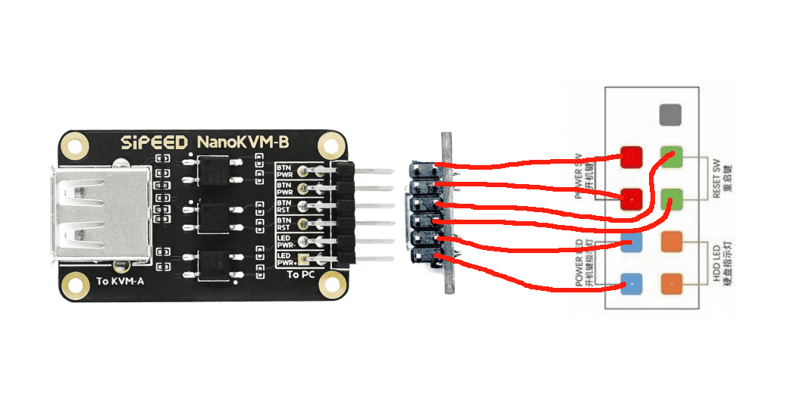
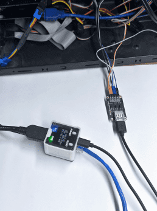
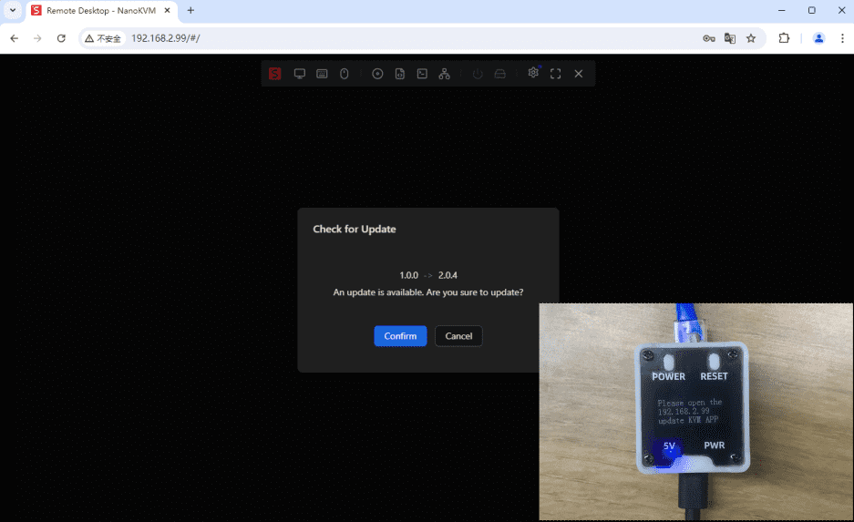

## Unboxing

The Full version includes NanoKVM (with case, with card), KVM-B board, 2 USB A to C cables, and Dupont cables.

The Lite version includes NanoKVM (without case and Micro SD card) and a heatsink.

## Interface Introduction

+ **The Full version features three USB Type-C interfaces with the following names and functions**

  + HID Interface (also called PC-USB), located below the HDMI interface, is used to connect the host, simulate keyboard and mouse, USB drive, and RNDIS devices.
  + AUX Interface, located above the HDMI interface, provides auxiliary power supply.
  + KVM-B Interface (also called ATX-Power), located above the Ethernet port, connects to KVM-B for power control functions.

## Power Supply

+ NanoKVM supports 5V power supply via regular USB, with a power consumption of about 1W. Some older motherboard models may have insufficient current, requiring additional power supply through the AUX interface.

+ Some motherboards' BIOS settings may default to turning off USB power when shut down. To ensure NanoKVM remains powered, please provide an additional 5V power supply through the AUX interface.

+ NanoKVM's USB CC interface features a 5.1K pull-down resistor, allowing the use of standard PD chargers. Some low-quality power supplies may output 12V directly without negotiation, which can damage NanoKVM.

Note: The first batch of internal test versions of the AUX interface does not include a CC pull-down resistor and cannot use C-C PD chargers. Please use a conventional 5V USB power adapter.

## Wiring

The wiring diagram for the NanoKVM-Full version is as follows. The Lite version only includes USB-C, HDMI, and Ethernet ports, and can refer to the Full version for wiring.

+ Use a USB C to A data cable to connect the remote host to the PC USB interface of NanoKVM (located below the HDMI interface).

+ Connect an HDMI (standard size) cable between the remote host and the HDMI interface of NanoKVM.

  

+ Connect NanoKVM to a router/switch using an Ethernet cable.

+ Use another USB C to A data cable to connect the KVM-B board to the ATX interface of NanoKVM (located above the Ethernet port).

  The official KVM-B board features a standard 9-pin header interface compatible with most motherboards, allowing direct connection. The case's power button and Power LED can be connected to the KVM-B header, as shown in the diagram (only the power button is connected here):

  

  > Note: The KVM-B board with version number 30132 cannot be directly connected to the pin header on the board with the built-in 9-pin bus header of the chassis, and must be connected with the included male to female cable according to the figure above.

  The wiring diagram for the internal test version of the KVM-B board and the host's 9-pin interface is shown below. The double-row headers are interconnected, allowing the connection of the case's power button and Power LED to the other row.

  > Note: In the early stage, the NanoKVM reboot will briefly pull up the RESET control pin, causing the connected computer to restart, in order to avoid this problem, please do not connect the RESET jumper, which has been fixed in the later official version

  
  

## Updates

### Update Image

> **The Lite version requires preparing a Micro SD card and flashing the image before use!**

The Full version comes with a pre-flashed image and can skip this step.

Images are updated periodically. It is recommended to update to the latest version for the best experience.

For detailed instructions, please refer to [Flashing Image](https://wiki.sipeed.com/hardware/zh/kvm/NanoKVM/system/flashing.html).

### Update Application

New applications often bring more features or fix important bugs. It is recommended to update NanoKVM applications to the latest version. For detailed instructions, please refer to [Updating Application](https://wiki.sipeed.com/hardware/zh/kvm/NanoKVM/system/updating.html).

## Basic Operations

### How to Obtain an IP Address

The Full version of NanoKVM has an OLED display that shows the IP address on the first line when connected to the network.

Lite version users, please refer to [Obtaining IP](https://wiki.sipeed.com/hardware/zh/kvm/NanoKVM/system/updating.html#%E8%8E%B7%E5%8F%96-IP).

### Viewing Remote Desktop

Open a browser and enter the obtained IP address to access the login page. The default username and password are admin/admin. After logging in, it is recommended to **check for updates** (Settings -> Check for Updates). Detailed steps can be found in [Updating Application](https://wiki.sipeed.com/hardware/zh/kvm/NanoKVM/system/updating.html).

For Lite version users, or Full version users who re-flashed the card and see no remote screen on the login page, please upgrade the application and refresh the webpage to start using.

Note: It is recommended to use Chrome browser, as other browsers may experience compatibility issues such as inability to display images or operate keyboard and mouse.

### Changing Account Password

**For security, please change the account password after confirming the functions are working properly.**

### ATX Power Control

The Full version package includes NanoKVM-A/B boards for controlling and viewing the host's power status.

+ The 5V LED (blue) on the top board indicates the power status of NanoKVM.
+ The PWR LED (green) indicates the power status of the host.
+ The POWER button functions as the host's power button, controlling the power on/off.
+ The RESET button acts as the host's reset button, forcing a restart when pressed while powered on.
+ Power status can also be viewed and controlled via the web interface. Refer to the [User Guide](https://wiki.sipeed.com/hardware/zh/kvm/NanoKVM/user_guide.html) for details.
