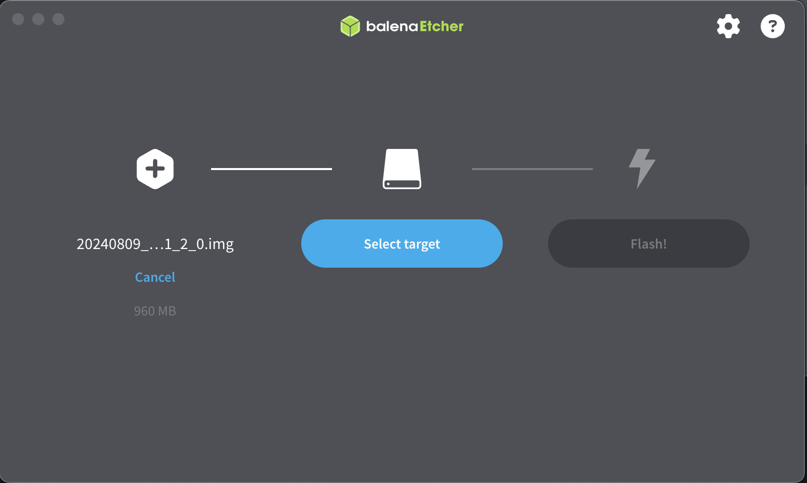

*The NanoKVM Full version comes pre-flashed with an image and can skip this step if desired.*

1. Prepare the SD Card:

    - The Full version comes with a 32G SD card. You will need to remove it by opening the case.
    - The Lite version requires you to prepare an SD card of at least 8G.

1. Go to [Github](https://github.com/sipeed/NanoKVM/releases) to download the latest version image.

1. Install the flashing software. We recommend using [Etcher](https://etcher.balena.io).

1. Run Etcher:
    

1. Click `Flash from file` and select the image file:

    

1. Click `Select target` and choose the SD card:

    

1. Click `Flash!` to start the flashing process:

    

1. Wait for the flashing process to complete.

    

Congratulations! The image has been successfully flashed!

You can now insert the SD card into the NanoKVM and proceed to the next steps.