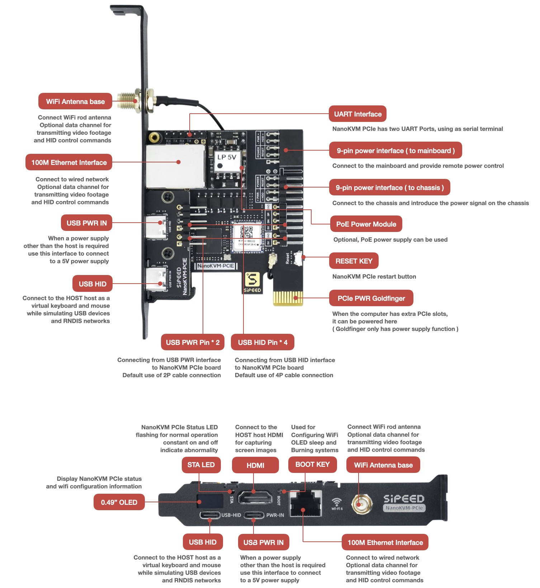
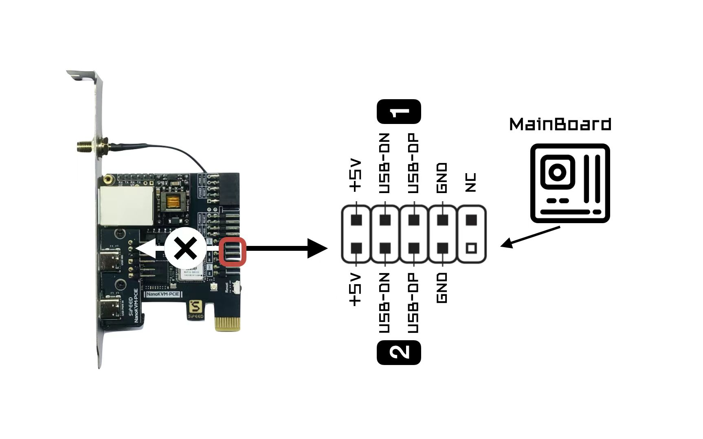
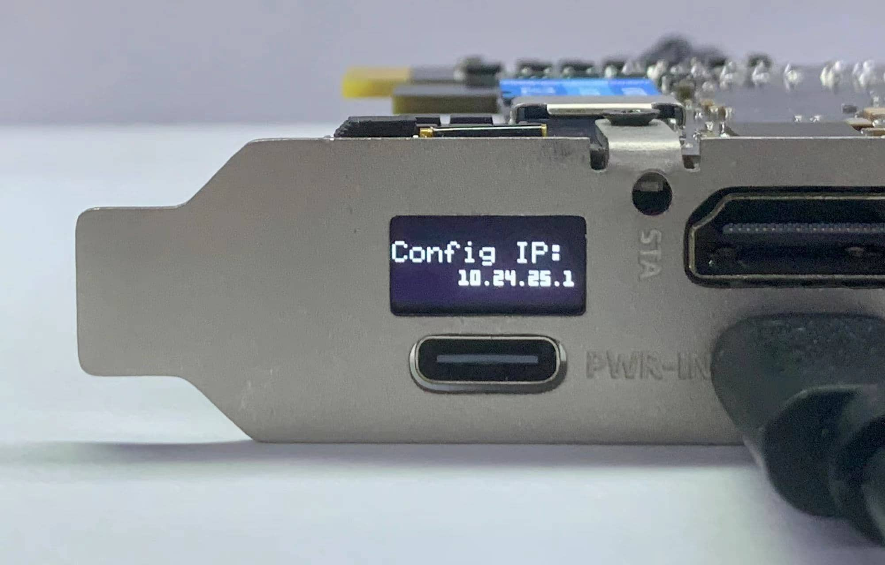

## Unboxing

The NanoKVM-PCIe package includes the main unit, a half-height PCIe bracket, two USB-A to C cables, one HDMI cable, one antenna, a 16-pin male to female ribbon cable, a 4-pin female to female ribbon cable, and a small screwdriver. The main unit features Dupont jumpers (2+4P) and an SMA antenna socket.

Note: The image above shows the NanoKVM-PCIe version with WiFi and PoE. The version without WiFi will have one less antenna and will be missing the SMA antenna socket on the bracket.

## Interface Introduction

The two USB-C ports on the old version of the beta hardware are reversed. Please refer to the diagram, and follow the labels on the backplate once you receive it.

## Power Supply

+ NanoKVM-PCIe offers multiple power supply options: USB HID direct power, USB PWR IN auxiliary power, power from the PCIe slot, and PoE power (optional). You can choose any one of these options. Having multiple power sources will not interfere with the operation of the NanoKVM-PCIe, but at least one power supply must be used.

Note: If you need USB HID direct power, you must enable the "Always Power USB" setting in the BIOS, otherwise, it will affect the remote power-on functionality.

Note: The USB-PWR-IN CC interface of the NanoKVM-PCIe has a 5.1K pull-down resistor, allowing it to be powered by a standard PD charger. Some low-quality PD chargers may pose a risk of damaging the NanoKVM-PCIe.

## Wiring

1. The wiring for NanoKVM-PCIe is similar to that of the Cube. Please install the NanoKVM-PCIe while the main unit is powered off and disconnected from power. Only after testing all functions as normal should you install it into the case.

2. Use a USB C to A data cable to connect the remote host to the USB-HID interface of the NanoKVM (located below the HDMI interface)

You can also connect directly to the nine-pin USB 2.0 inside the case, as shown in the diagram below.

When connecting, be sure to refer to the diagram above and the internal interface diagram of the NanoKVM-PCIe below. Please check repeatedly before powering on; incorrect connections may risk damaging the NanoKVM! The silkscreen for "HDD LED" on the connection lines of some batches is incorrect. Please adjust according to the actual situation.

3. Use the included HDMI cable to connect the remote host to the HDMI interface of the NanoKVM.

4. Use an Ethernet cable to connect the router/switch to the NanoKVM. If you ordered the WiFi version of NanoKVM-PCIe after 24/12/07, this step can be skipped. Refer to the WiFi configuration section for connecting via WiFi.

5. ATX Power Control: The principle of remote control of the main power supply is to simulate the action of pressing the power button and read the LED status to synchronize with the webpage. For this, you need to disconnect the nine-pin connector on the motherboard that was originally connected to the case power button and connect it to the corresponding interface on the NanoKVM-PCIe. Additionally, to allow the case button to still control the power, you need to connect the power wiring from the case to the NanoKVM-PCIe. 

When wiring, please be sure to refer to the diagram above and the internal interface diagram of the NanoKVM-PCIe.

Note: NanoKVM-PCIe does not monitor HDD status.

## WiFi Configuration

+ This step is only applicable to the NanoKVM-PCIe version with WiFi; other versions will display "--" in the WiFi icon position.

+ If you are unable to connect an Ethernet cable, NanoKVM-PCIe provides an AP configuration function. Connect your phone to the AP created by NanoKVM -> enter the web configuration.
  The specific steps are as follows:
  1. Power on the device and wait for the main UI to appear. The current WiFi status will not be lit, indicating no WiFi IP.
    
  2. Use the included small screwdriver to press and hold the BOOT button in the PCIe panel for more than 2 seconds.
    
  3. Wait for the WiFi AP QR code to appear, then scan the code to connect to the AP.
    
    
  4. Once your phone is successfully connected, a web QR code will appear on the OLED display. Scan the code to automatically redirect to the configuration page.
    
    
  5. Enter the WiFi account (SSID) and password for the NanoKVM-PCIe, then click OK to complete the configuration.
    
    
  
  Note:
  + If you cannot connect to the AP via the QR code, you can short-press the BOOT button. The OLED will display the AP SSID and password, which can be used to connect through your phone's system settings.
  + If you cannot open the webpage via the QR code, you can short-press the BOOT button, and the OLED will display the WiFi configuration address. Enter this address in your phone's browser to configure.
    
  + If you cannot open the configuration webpage, please turn off mobile data and try again.
  + If the WiFi account or password is set incorrectly, the OLED will return to step 3. Please reconnect to the AP for configuration.
  + Long pressing the BOOT button will exit the WiFi configuration interface.
  + For security reasons, a random AP password will be generated each time you configure WiFi. It is recommended to follow the above steps to complete the configuration.

## Updates

### Update Application

New applications often bring more features or fix important bugs. It is recommended to update NanoKVM applications to the latest version. For detailed instructions, please refer to [Updating Application](https://wiki.sipeed.com/hardware/zh/kvm/NanoKVM/system/updating.html).

## Basic Operations

### How to Obtain an IP Address

The PCIe version of NanoKVM comes with an OLED display, which will show the IP address after connecting to the network.

For the WiFi version of NanoKVM-PCIe, the IP addresses obtained via ETH and WiFi will alternate on the display. The IP address with an 'E' prefix is the ETH IP, while the one with a 'W' prefix is the IP obtained via WiFi.

### Viewing Remote Desktop

Enter the obtained IP directly in your browser to access the login page. The default username and password are both admin. After logging in, it is recommended to change your password and [update](https://wiki.sipeed.com/hardware/zh/kvm/NanoKVM/system/updating.html) to the latest applications.

**Note:** It is recommended to use the Chrome browser, as other browsers may experience compatibility issues such as inability to display the screen or operate the keyboard and mouse.

### ATX Power Control

If the power control interface is connected, you can remotely control the computer's power on from the web page.

+ The web interface provides power status indicators and functions for the power and reset buttons, but it cannot monitor the HDD activity light status.

