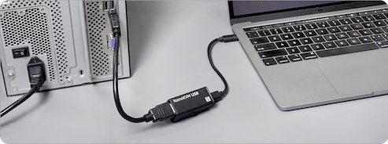
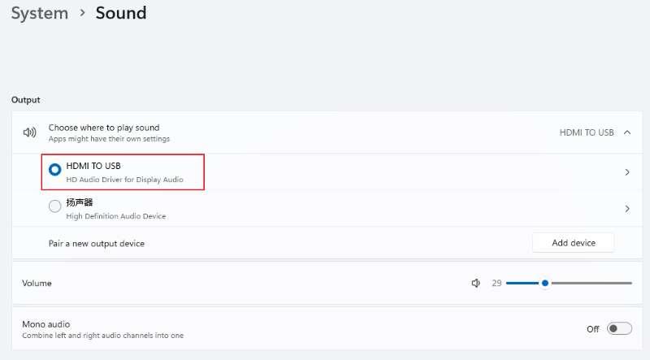

## Interface

## Wiring

Use a USB3.0 or Type-C cable to connect NanoKVM-USB and the Host device.

Use an HDMI cable to connect NanoKVM-USB and Target device.

Use a USB3.0 cable to connect NanoKVM-USB and Target device.

## Use in Web

### Open the webpage

Use Chrome browser to visit `https://usbkvm.sipeed.com`.

> Please use the desktop Chrome browser, and the version number must be greater than 89.
>
> Mobile Chrome or other browsers that do not support [Web Serial API](https://developer.mozilla.org/en-US/docs/Web/API/Serial) cannot use keyboard and mouse.

### Authorization

NanoKVM-USB will simulate a USB camera to transmit video and audio data. Therefore, the web page must obtain permission to use the camera.

> If you rejected the authorization or want to turn off the authorization, you can choose to reset all permissions.
>
> 

### Select USB devices

After obtaining authorization, We need to select two USB devices:

1. USB camera: for video and audio input;
2. Serial device: for sending keyboard and mouse data.

#### USB Camera

Click the drop-down button and select the camera device named in the format of `USB Video`.

Once the device is selected, the web page will start to display the video image.

#### Serial Port Device

Click the "Select Serial Port" button to display a list of all available serial devices, from which you can choose the corresponding serial device.

> On Windows, the format is `COMx`; on macOS, it is `USB Serial`; on Linux, it is generally `/dev/ttyUSBx`.

> If the browser does not support Web Serial API, the button will not be displayed and the keyboard and mouse is not available.

Setup complete!

Enjoy it!

### Audio

If the webpage does not play sound automatically, some manual setups are required.

Here is an example of Mac controlling Windows:

#### Target side

On the Target side(Windows), select NanoKVM as the **audio output** device.

The name of the audio device depends on whether a loopback device is connected:

- If the loopback device is not connected, the audio device name is `HDMI TO USB`;
- If the loopback device is connected, the name of the audio device is the same as the loopback device.

#### Host side

On the Host side(Mac), select NanoKVM as the **audio input** device.

The name format of the audio device is generally `USB Digital Audio`.

### Mouse

The mouse uses the `absolute mode` by default.

In the BIOS or some systems, this mode may not work properly. Please switch to the `relative mode` if the mouse is not available.

