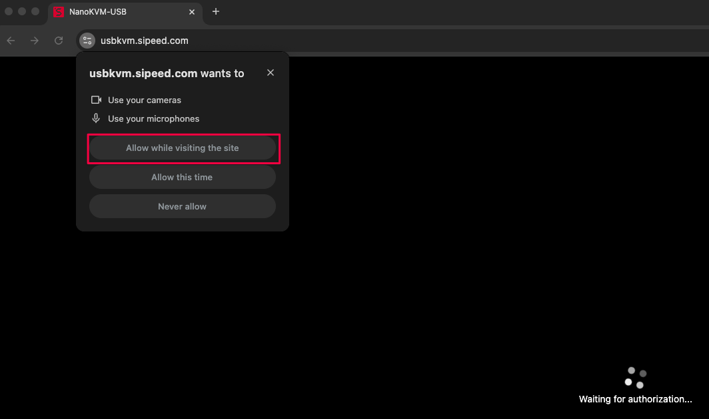
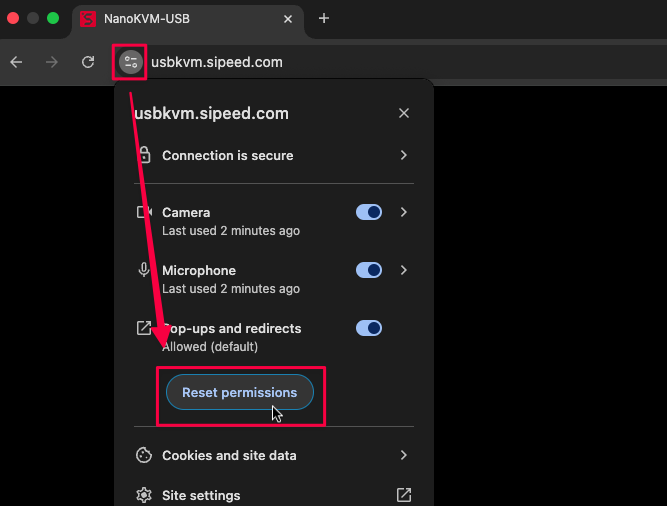

## 接口介绍

## 接线

使用 USB3.0 或 TypeC 线连接 NanoKVM-USB 与 Host 主机。

使用 HDMI 线连接 NanoKVM-USB 与 Target 主机。

使用 USB3.0 线连接 NanoKVM-USB 与 Target 主机。

## 网页

### 打开网页

使用 Chrome 浏览器访问 `https://usbkvm.sipeed.com`。

> 请使用桌面端 Chrome 浏览器，且版本号大于 89。
>
> 由于使用了 [Web Serial API](https://developer.mozilla.org/en-US/docs/Web/API/Serial)，移动端 Chrome 和其它不支持该特性的浏览器均无法使用键鼠。

### 授权

NanoKVM-USB 会模拟成 USB 摄像头，用于传输视频和音频。因此网页首先需要获取摄像头使用权限。

> 如果您拒绝了授权，或者想关闭该授权，可以重置权限。下次访问时会重新进入该步骤。
> 

### 选择 USB 设备

在获取授权后，网页会显示一个选择 USB 设备的弹窗。我们需要在这里选择两个设备：

1. USB 摄像头：用于视频和音频的输入；
2. 串口设备：用于发送键盘和鼠标数据。

首先点击下拉框，选择以 USB Video 格式命名的摄像头设备。选择设备后网页就会开始显示视频画面。

如果不确定选择哪一个设备，可以依次选择以找出正确的设备。

然后点击选择串口按钮，会弹出所有可用的串口设备列表，从中选择以 USB Serial 格式命名的设备。

> 如果当前浏览器不支持串口，则不会显现该按钮。此时网页仅有视频传输功能，无法使用键盘和鼠标。

设置完成！到这里就可以开始正常使用了。
