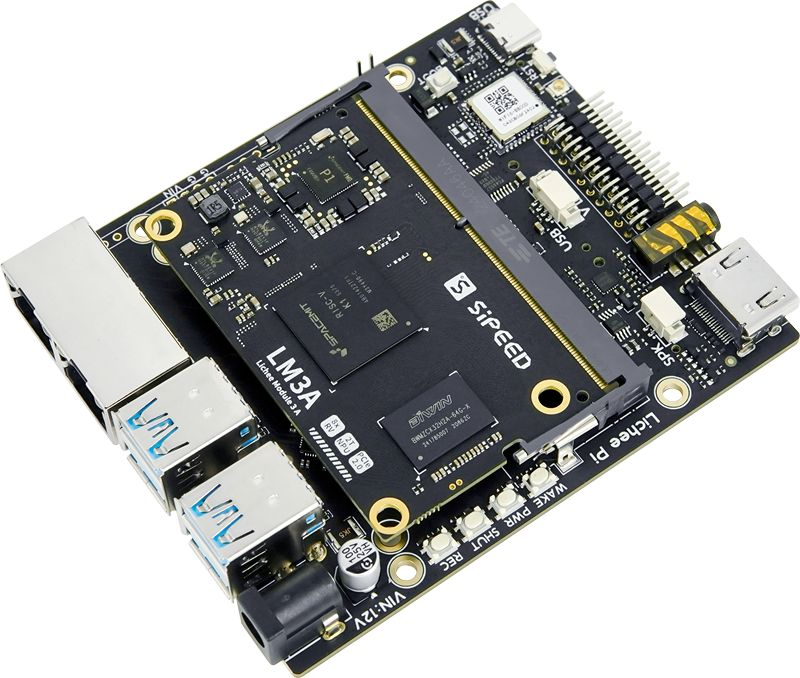

## Intro

LicheePi 3A is based on the [Lichee Module 3A](http://wiki.sipeed.com/hardware/zh/lichee/K1/lm3a.html)High performance RISC-V Linux development board for the core board, with [K1](https://www.spacemit.com/key-stone-k1/) SOC（ 8xX60@1.6G ， RV64GCV， 2TOPS@int8   NPU， 20GFLOP GPU）， Onboard maximum 16GB 32-bit LPDDR4X, 128GB eMMC, supports HDMI+MIPI dual 1080P display output, supports 16MP camera access, dual gigabit Ethernet ports (one of which supports POE power supply) and 4 USB3.0 interfaces, as well as 2 PCIE Gen2x2 channels, multiple audio input and output.

LicheePi 3A is currently the most cost-effective mid-range RISC-V SBC. Multi core performance comparable to the previous generation RISC-V SBC [LPi4A](http://wiki.sipeed.com/hardware/zh/lichee/th1520/lpi4a.html) 80%, with a single core performance of approximately 50%

 
LicheePi 3A can be used as a typical RISC-V verification platform, and its powerful performance enables fast local compilation without the need for QEMU compilation.
LicheePi 3A is basically compatible with LicheePi4A. If you have purchased LicheePi4A, you can only purchase LM3A to install on the LPi4A motherboard (without M.2 interface).

## Basic Parameter

<table>
<thead>
<tr>
  <th colspan=2>SOC Parameter</th>
</tr>
</thead>
<tbody>
<tr>
  <td>SOC</td>
  <td>Spacemit K1</td>
</tr>
<tr>
  <td>CPU</td>
  <td>RISC-V 64GCV X60*8@1.6GHz  · Cluster0 2TOPS AI-Power, 32K L1-Cache per core, 512K L2-Cache, 512KB TCM, Vector-256bit  · Cluster0 32K L1-Cache per core, 512K L2-Cache, Vector-256bit </td>
</tr>
<tr>
  <td>GPU</td>
  <td>· IMG BXE-2-32@819M  · OpenGL ES 3.2, OpenCL 3.0 · Vulkan 1.3 · 20GFLIPS </td>
</tr>
<tr>
  <td>NPU</td>
  <td>Cluster0 2TOPS@INT8   · support TensorFlow、ONNX、Caffe  · 支持 CNN、RNN、DNN 等</td>
</tr>
<tr>
  <td>Video</td>
  <td>H265&H264 @ 1080p 60fps decode/encode</td>
</tr>
<tr>
  <th colspan=2>Hardware Feature</th>
</tr>
<tr>
  <td>RAM</td>
  <td>· 8GB 32bits LPDDR4X · 16GB 32bits LPDDR4X </td>
</tr>
<tr>
  <td>Storage</td>
  <td>· eMMC: 32G / 128G  · TF Card ·  NVMe SSD</td>
</tr>
<tr>
  <td>Ethernet</td>
  <td>· 2 x GbE，optional POE</td>
</tr>
<tr>
  <td>PCIe (x3)</td>
  <td>· PCIE PortA Gen2x1 (combo with USB3) · PCIE PortB Gen2x2 · PCIE PortC Gen2x2</td>
</tr>
<tr>
  <td>USB</td>
  <td>· USB3.0 x 4 · USB2.0 x 2</td>
</tr>
<tr>
  <td>Audio</td>
  <td>· 1 x 3.5mm Headphone · 2Pin Speaker </td>
</tr>
<tr>
  <td>Display</td>
  <td>· 1 x HDMI1.4 · 1 x 4-lane MIPI DSI</td>
</tr>
<tr>
  <td>Camera</td>
  <td>· 1 x 2-lane MIPI CSI · 1 x 4-lane MIPI CSI</td>
</tr>
<tr>
  <td>GPIO</td>
  <td>· UART · IIC · SPI</td>
</tr>
</tbody>
</table>

### Hardware download

[Spec](https://dl.sipeed.com/shareURL/LICHEE/LicheePi3A/01_Specification)
[Sch](https://dl.sipeed.com/shareURL/LICHEE/LicheePi3A/02_Schematic)
[Bit number map](https://dl.sipeed.com/shareURL/LICHEE/LicheePi3A/03_Bit_number_map)
[Dimensional_drawing](https://dl.sipeed.com/shareURL/LICHEE/LicheePi3A/04_Dimensional_drawing)
[3D model](https://dl.sipeed.com/shareURL/LICHEE/LicheePi3A/05_3D_model)

## 其他链接

[Taobao](https://item.taobao.com/item.htm?id=)
[Aliexpress](https://xxx)
[Sipeed 下载站](https://dl.sipeed.com/shareURL/LICHEE/LicheePi3A)

QQ: 559614960 [点我自动加群](http://qm.qq.com/cgi-bin/qm/qr?k=5YkapIhdtWHp8AEfM5_bFFYQIX3CUQN6)
Telegram: https://t.me/linux4rv

Fourm ：Maixhub.com/discussion
Mail：support@sipeed.com
