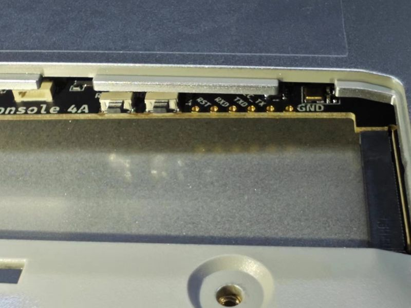

## Image download

https://github.com/0x754C/sipeed-th1520-laptop-extra/releases

Baidu Pan：
Link: https://pan.baidu.com/s/1jkJ4YR7EhMRZ11XmccKDtg   
code: qj1r   

Mega：   
https://mega.nz/folder/p9BCTbLb#sWSZvLw6nrBmqujQXfvWrg   


## Full Image

### Flashing via Type-C Port

1. Remove the SSD cover.

2. Locate the BOOT button and the RST button.



3. Press and hold the BOOT button, then press the power button on the keyboard to turn on the device (or press the reset button if the device is already on). Connect the Book to the PC via the Type-C port for flashing the image.


4. Download the flashing image on the PC.


5. Execute the flashing commands:

```
fastboot flash ram u-boot-with-spl-plastic8g.bin   #Choose according to the purchased memory model
fastboot reboot
fastboot flash uboot u-boot-with-spl-plastic8g.bin
fastboot flash boot boot.ext4
fastboot flash root root.ext4
```

10. Press the RST button next to the BOOT button to restart the Book laptop.


