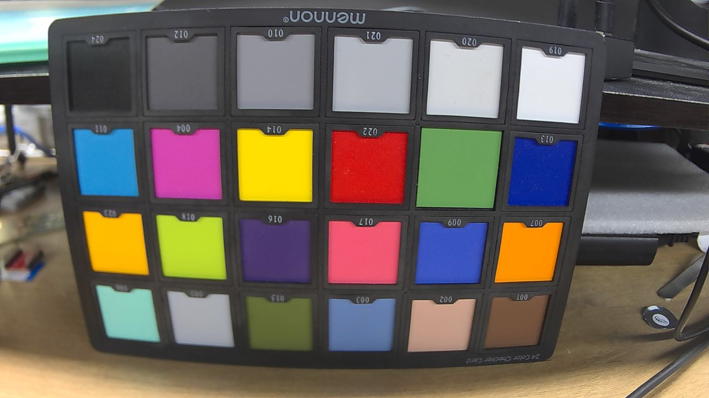
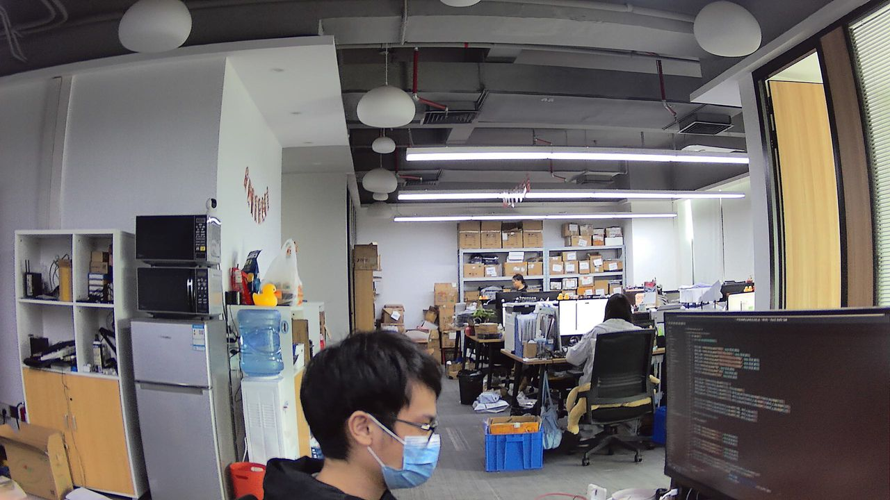
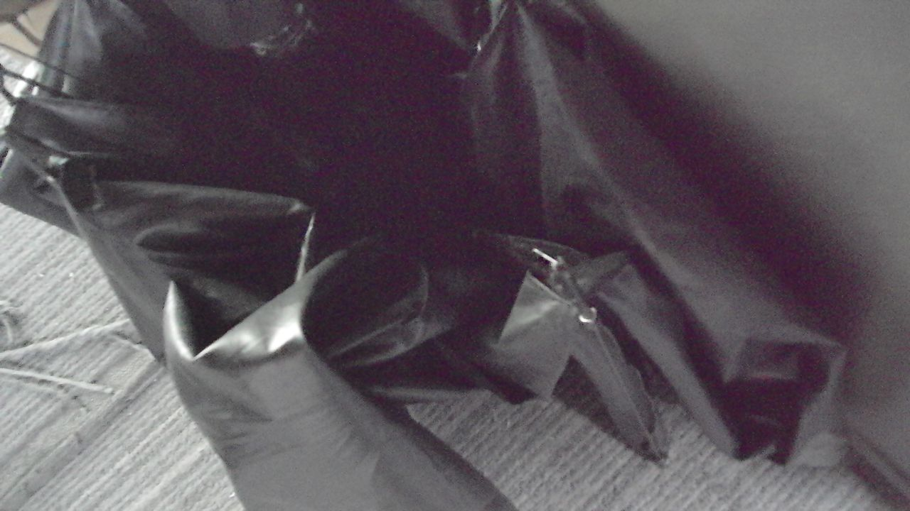
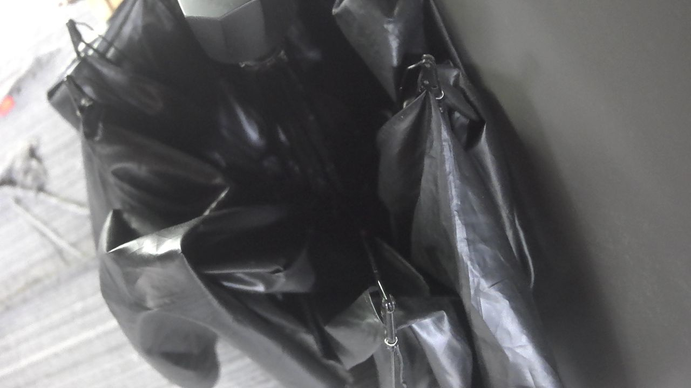
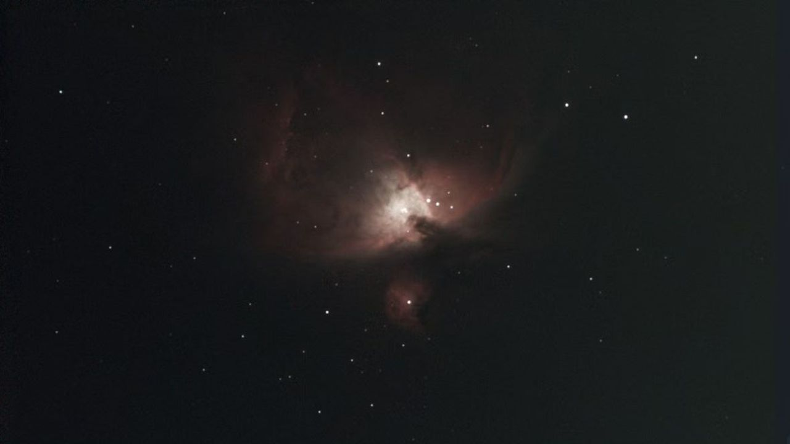
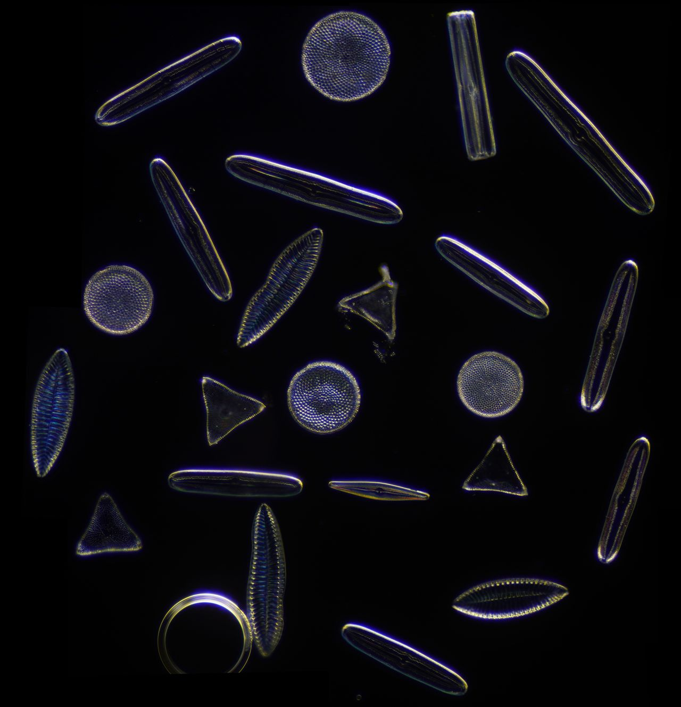
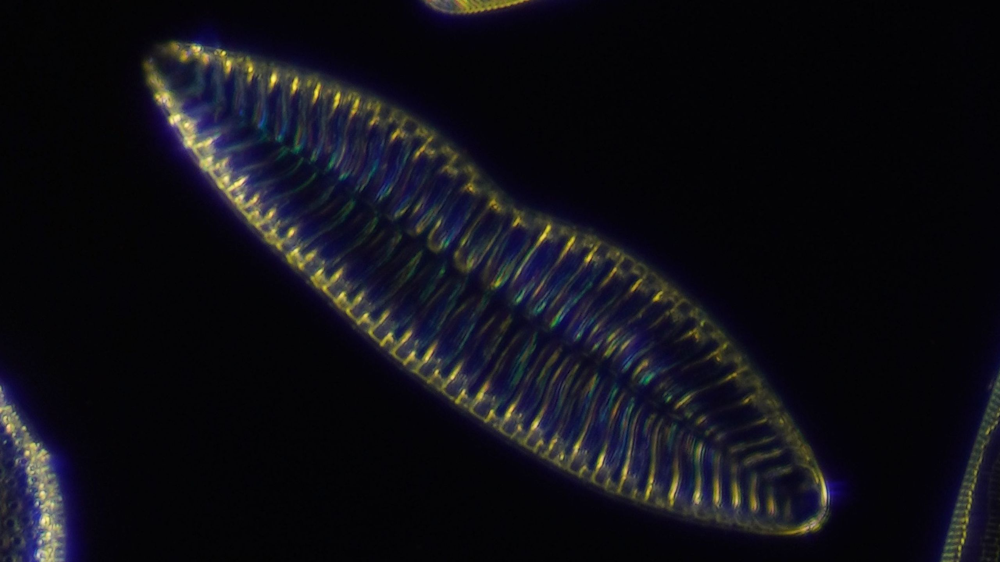

## Camera Module Parameter Comparison

| **Sensor Model** | GC4653            | OS04A10           | SC035HGS         |
|------------------|-------------------|-------------------|------------------|
| **Resolution**    | 2560x1440         | 2688x1520         | 640x480          |
| **Size**          | 1/3"              | **1/1.79"**       | 1/6"             |
| **Pixel Size**    | 2.0um             | 2.9um             | 3.744um          |
| **Shutter Type**  | Rolling Shutter   | Rolling Shutter   | **Global Shutter** |
| **Frame Rate**    | 30fps@2K, 60fps@720P | 30fps@2K      | 180fps@VGA       |
| **Max Exposure**  | 0.5s              | 45s               | TBD              |
| **Sensitivity**   | 2.4V/Lux.s        | 32000e/Lux.s      | 6.5V/Lux.s       |
| **Dynamic Range** | 81dB              | 120dB             | 60dB             |

* [Sensor Manual Download](https://dl.sipeed.com/shareURL/MaixCAM/Sensors)

## Sensor Selection Recommendations
1. **GC4653**: Suitable for general applications with good image quality. It achieves a high frame rate of 60fps at 720P resolution.
2. **OS04A10**: Ideal for low-light scenarios (e.g., astrophotography, dark-field imaging, uniform-light imaging). It has better noise control than GC4653 and supports up to 1-minute long exposure. The sensor itself supports extremely high frame rates (2K@90fps, 720P@180fps, 360P@360fps, 180P@720fps), although these are not yet tuned for MaixCAM.
3. **SC035HGS**: A global shutter camera that avoids the "jelly" distortion caused by rolling shutters. Suitable for capturing fast-moving objects, as demonstrated in a video capturing QR codes on a fast-spinning record.

## Sensor Real-World Performance Comparison
| Test Item       | GC4653                              | OS04A10                             |
|-----------------|------------------------------------|-------------------------------------|
| Color Chart     |  |  |
| Distant Details |    |    |
| Low-Light Performance |  |  |

Comparison in indoor, hallway, and stairwell completely dark environments:  
<video playsinline controls muted preload style="width:100%" src="../../assets/maixcam/comapre_gc4653_os04a10.mp4"></video>

### **Star Time-Lapse Captured by OS04A10**  
Shot using a fisheye lens:  
<video playsinline controls muted preload style="width:100%" src="../../assets/maixcam/os04a10_stars.mp4"></video>

### **M42 Nebula Captured by OS04A10**  
Shot with a 400mm telescope, 15s exposure, multiple frames stacked:  

### **Diatom Micrograph Captured by OS04A10**  
Shot using a dark-field microscope, multiple frames stitched:  
  
Close-up single frame detail:  

