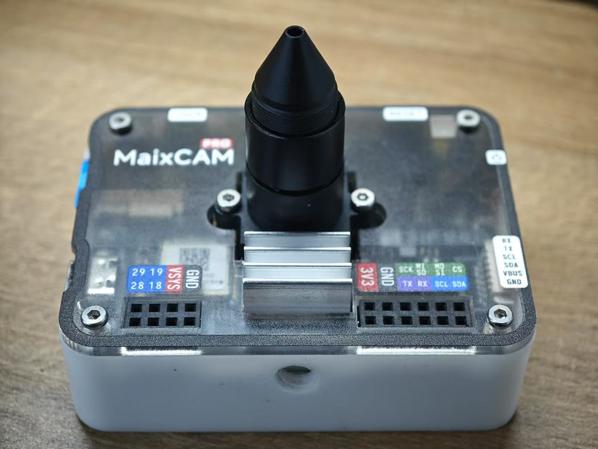
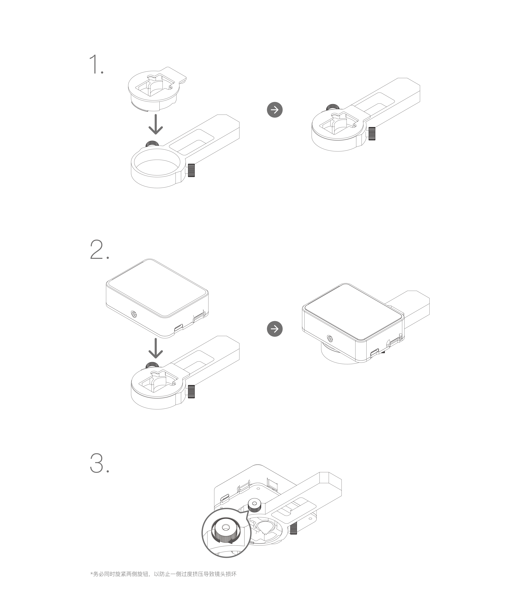
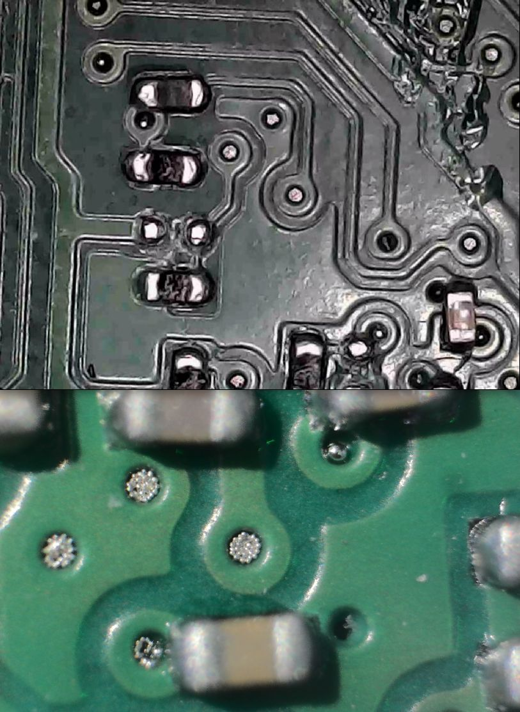
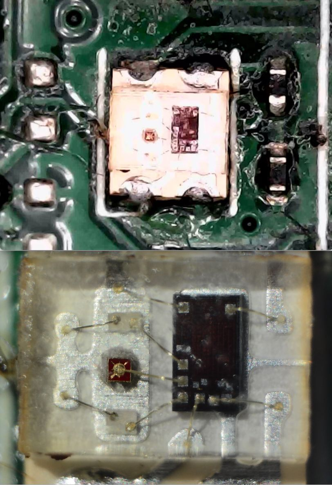

## Microscope Kit

The MaixCAM Microscope Kit transforms your MaixCAM / MaixCAM Pro into a portable digital microscope. It surpasses similarly priced digital microscopes in performance while offering open-source capabilities, allowing you to customize unique functions for your digital microscope.  
The MaixCAM Microscope Kit is ideal for soldering small components, observing biological specimens, focus stacking photography, and more. Explore various applications with this versatile kit!

### Single Lens Kit

Includes only the 10mm tapered lens, 10mm spacer ring, and anti-glare flocking stickers. It is suitable for handheld use or if you already have a universal microscope stand.  

**Usage:** Unscrew the original MaixCAM lens and replace it with the tapered lens.  
For higher magnification, attach the 10mm spacer ring first, followed by the tapered lens.  

- The closer the lens is screwed inward, the lower the magnification, and the lens-to-object distance increases (up to ~10 cm).  
- The farther the lens is screwed outward, the higher the magnification, and the lens-to-object distance decreases (down to ~1 cm).  

| Installation Method               | Optical Magnification | Field of View | Suitable Objects          |
|-----------------------------------|-----------------------|---------------|---------------------------|
| 10mm tapered lens (fully inward)  | 0.25X                 | 20.5x11.5mm   | PCBs, FPC soldering       |
| 10mm tapered lens (fully outward) | 0.6X                  | 8.5x4.8mm     | IC markings, fine soldering|
| Tapered lens + 10mm spacer (inward)| 1.0X                  | 5.1x2.9mm     | IC chips, larger specimens|
| Tapered lens + 10mm spacer (outward)| 2.0X                 | 2.56x1.44mm   | IC chip details, cells    |

1. The magnifications above are optical, not exaggerated marketing values like hundreds or thousands of times.  
2. Field of view examples are based on GC4653. For OS04A10, scale proportionally by 3/1.8 = 1.67x.  

After installation, you can observe and capture images using the built-in camera app on MaixCAM.  
For low-light conditions, turn on the flashlight via the app.  
If glare occurs, trim the anti-glare flocking and attach it to the inner side of the tapered lens.  

### Manual Stand Kit

Includes:  
1. **Lens:** 10mm tapered lens, 10mm spacer ring  
2. **Stand:** Precision aluminum alloy stand components  
3. **Biological Specimen:** Onion epidermis specimen, white stage  
4. **Extras:** Anti-glare flocking  

Refer to the lens installation method above.  
The assembled stand and MaixCAM setup appear as follows. For larger targets like PCBs, the spacer ring is typically unnecessary:  

The package comes with a mounting bracket to help secure the MaixCAM Pro, which can be installed as follows

A mini heating table can be added for soldering tasks:  

For small biological specimens, use the spacer ring, enable the flashlight, and optionally activate focus magnification in the camera app.  
Place the provided onion epidermis specimen on the white stage and observe with lighting and magnification enabled:  

Example results:  
  

### Motorized Stand Kit

A future release featuring a motorized sliding platform for automatic focusing and stacked photography.  
<video playsinline controls muted preload style="width:100%" src="../../assets/maixcam/micro_focus.mp4"></video> 

## Performance Comparison

### Specification Table

|               | **MaixCAM Microscope Kit** | **Darwin M2 Microscope** |
|---------------|-----------------------------|-------------------------------|
| Sensor Resolution | 2560x1440               | 1600x1200                     |
| Display         | 2.4-inch 640x480         | 4-inch 800x480                |
| Interaction     | Full-screen touch        | Physical + touch buttons      |
| Aperture        | F1:2.5 (brighter)        | F1:4.5                        |
| Photo Capture   | ✓ Adjustable parameters   | ✓ Fixed parameters            |
| Video Recording | MP4 (smaller size)       | AVI (larger size)             |
| Timelapse       | ✓                        | X                             |
| Optical Magnification | No spacer: 0.25~0.6 With spacer: 1.0~2.0 | 0.42~0.92 |
| Single Pixel Size (Max Magnification) | 1µm                   | 2.7µm                        |
| Stand           | Sturdy aluminum alloy    | Basic plastic stand           |

### Picture Comparison

Each image below shows the maximum magnification for both microscopes:  
- **Top Image:** Darwin M2 Microscope  
- **Bottom Image:** MaixCAM Microscope  

  
  
  
  
  
  
