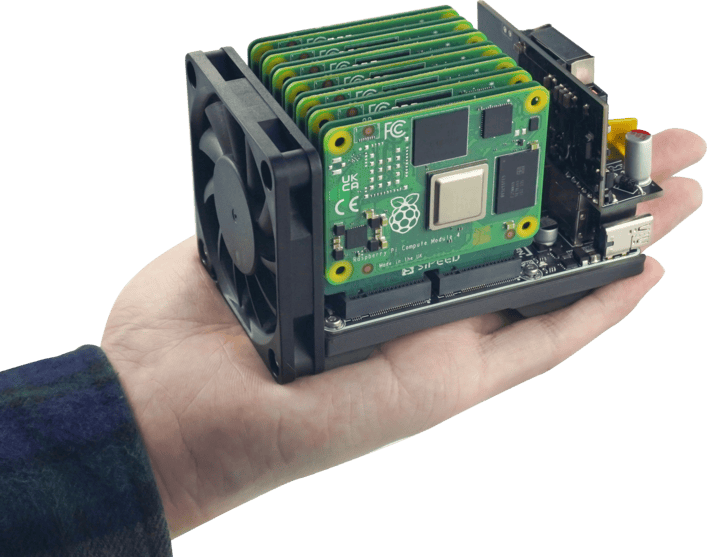

## 简介

NanoCluster 是矽速科技开发的超迷你集群板，板载 7 个 SOM 插槽，采用基于 RISC-V 架构的千兆交换机互联，支持 USB-C PD 供电，并可扩展 PoE 供电。同时，NanoCluster 提供独立的 UART 和电源控制，使其成为 HomeLab 用户入门分布式计算、Kubernetes 和 Docker 实践，以及边缘计算的理想选择。

NanoCluster 兼容矽速科技的 Longan Module 3H（4 × Cortex-A53）、M4N（4 × Cortex-A55 + NPU），以及树莓派的 Compute Module 4（4 × Cortex-A72） 和 Compute Module 5（4× Cortex-A76）。用户可以根据性能需求和预算自由选择核心板，也可以混合搭配不同架构的核心板，构建一个高度定制化的计算集群。

NanoCluster 采用开放的 SOM 接口标准，不仅支持官方核心板，也允许用户自行设计转接板，以适配自定义核心板或其他第三方 SOM 方案，极大提升了平台的灵活性。

 

## 技术规格

### 底板

<table>
  <thead>
    <tr>
      <th colspan="2">硬件参数</th>
    </tr>
  </thead>
  <tbody>
    <tr>
      <td><strong>SOM 插槽</strong></td>
      <td>7× 双 M.2 M-Key 立式插槽</td>
    </tr>
    <tr>
      <td><strong>供电</strong></td>
      <td>USB-C 20V PD 供电，最大 60W，可选配 60W PoE 模块供电</td>
    </tr>
    <tr>
      <td><strong>以太网</strong></td>
      <td>板载 RISC-V 千兆交换芯片 JL6108 高速互联，支持 Web 页面管理和 SDK 自定义功能开发</td>
    </tr>
    <tr>
      <td><strong>USB 接口</strong></td>
      <td>USB-A Host（上），USB-A OTG（下），与 Slot 1 连接</td>
    </tr>
    <tr>
      <td><strong>显示接口</strong></td>
      <td>HDMI 接口，与 Slot 1 连接</td>
    </tr>
    <tr>
      <td><strong>散热系统</strong></td>
      <td>配备 60mm 2Pin 风扇，高效散热</td>
    </tr>
    <tr>
      <td><strong>状态指示</strong></td>
      <td>7× SYS LED 指示灯，用于各个计算节点状态监测</td>
    </tr>
    <tr>
      <td><strong>串口通信</strong></td>
      <td>7× 独立 UART，便于调试与控制，可选配四串口 USB 模块</td>
    </tr>
    <tr>
      <td><strong>电源管理</strong></td>
      <td>Slot1 通过 IO 扩展芯片集中管理其他 Slot 及交换机电源</td>
    </tr>
    <tr>
      <td><strong>功耗</strong></td>
      <td>3.6 W</td>
    </tr>
    <tr>
      <td><strong>尺寸</strong></td>
      <td>PCBA：88x57mm，插满 SOM 并安装风扇后约 100x60x60mm</td>
    </tr>
  </tbody>
</table>

### SOM

<table>
    <tr>
        <th>SOM</th>
        <th>LM3H</th>
        <th>M4N</th>
        <th>CM4</th>
        <th>CM5</th>
    </tr>
    <tr>
        <td>主控芯片</td>
        <td>H618</td>
        <td>AX650N</td>
        <td>BCM2711</td>
        <td>BCM2712</td>
    </tr>
    <tr>
        <td>内存</td>
        <td>2GB ~ 4GB</td>
        <td>8GB</td>
        <td>1GB ~ 8GB</td>
        <td>1GB ~ 16GB</td>
    </tr>
    <tr>
        <td>eMMC</td>
        <td>32GB</td>
        <td>32GB</td>
        <td>0GB ~ 64GB</td>
        <td>0GB ~ 64GB</td>
    </tr>
    <tr>
        <td>CPU</td>
        <td>4 × A53 1.5 GHz</td>
        <td>8 × A55 1.6 GHz</td>
        <td>4 × A72 1.5 GHz</td>
        <td>4 × A76 2.4 GHz</td>
    </tr>
    <tr>
        <td>GPU</td>
        <td>Mali-G31</td>
        <td>-</td>
        <td>VideoCore VI</td>
        <td>VideoCore VII</td>
    </tr>
    <tr>
        <td>NPU</td>
        <td>-</td>
        <td>18TOPS INT8</td>
        <td>-</td>
        <td>-</td>
    </tr>
    <tr>
        <td>网络连接</td>
        <td>百兆</td>
        <td>千兆</td>
        <td>千兆</td>
        <td>千兆</td>
    </tr>
    <tr>
        <td>其它接口</td>
        <td>None</td>
        <td>下载接口 + M.2 SSD + USB 3.0</td>
        <td>下载接口 + M.2 SSD</td>
        <td>下载接口 + M.2 SSD + USB 3.0</td>
    </tr>
    <tr>
        <td>功耗 空载 / 满载 / 峰值</td>
        <td><nobr>1.2W/2.6W/3.7W</nobr></td>
        <td><nobr>3W/8.3W/9W</nobr></td>
        <td><nobr>3W/4.5W/4.6W</nobr></td>
        <td><nobr>4W/7.6W/8W</nobr></td>
    </tr>
</table>

## 接口图示

### 底板接口

### SOM

LM3H 核心板通过 7 × 双 M.2 M-Key 立式插槽直接连接到底板。

M4N 核心板则先通过 BTB（板对板）连接器与转接板对接，再连接到底板。

<table>
    <tr>
        <th>SOM</th>
        <th>LM3H</th>
        <th>M4N</th>
    </tr>
    <tr>
        <td>正面</td>
        <td></td>
        <td></td>
    </tr>
    <tr>
        <td>反面</td>
        <td></td>
        <td></td>
    </tr>
</table>

### 转接板

CM4 / CM5 转接板正面配有 BTB 连接器，支持连接 CM4 和 CM5 核心板，同时集成了 Boot 按键和用于烧录的 Type-C 接口。背面包括一个 SD 卡槽、一个 M.2 NVMe 固态硬盘接口（兼容 2242 或 2230 尺寸），以及一个预留的 USB 焊盘，可选支持 CM5 的 USB 3.0。

M4N 转接板正面配有 BTB 连接器，用于连接 Sipeed M4N 核心板，同时配备 Boot 按键和用于烧录的 Type-C 接口。背面包括一个 M.2 NVMe 固态硬盘接口（2242 或 2230），以及一个预留的 USB 焊盘，可选支持 USB 3.0。

<table>
    <tr>
        <th>转接板</th>
        <th>CM4 / CM5</th>
        <th>M4N</th>
    </tr>
    <tr>
        <td>正面</td>
        <td></td>
        <td></td>
    </tr>
    <tr>
        <td>反面</td>
        <td></td>
        <td></td>
    </tr>
</table>

## 软硬件资料

### 底板硬件资料

[点击查看](https://dl.sipeed.com/Cluster/NanoCluster)

### Longan Module 3H 资料

硬件资料可在此获取：[点击查看](https://dl.sipeed.com/shareURL/LONGAN/LonganPi3H)。系统构建与软件开发指南请参考：[点击这里](https://wiki.sipeed.com/hardware/zh/longan/h618/lpi3h/7_develop_mainline.html)。

### M4N 资料

+ [硬件相关资料](https://dl.sipeed.com/shareURL/MaixIV/M4N-Dock)
+ [软件开发文档](https://dl.sipeed.com/shareURL/MaixIV/M4N-Dock)
+ [软件开发SDK](https://github.com/AXERA-TECH/ax650n_bsp_sdk)

### Raspberry Pi Compute Module 4

[点击查看](https://www.raspberrypi.com/products/compute-module-4)

### Raspberry Pi Compute Module 5

[点击查看](https://www.raspberrypi.com/products/compute-module-5)

## 购买入口

[预售入口](https://sipeed.com/nanocluster)

## 产品反馈

如果您在使用过程中有任何问题或建议，请通过以下渠道和我们反馈：

+ [Github issues](https://github.com/sipeed/NanoCluster)