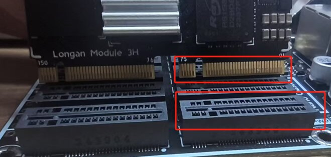
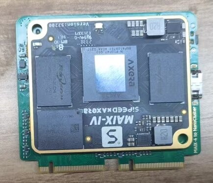
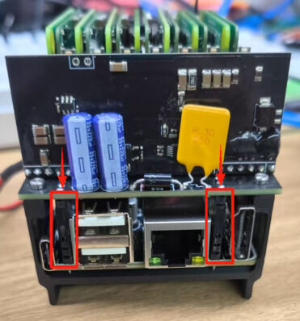
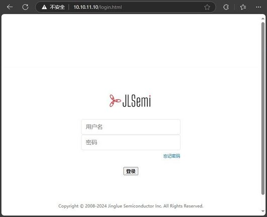
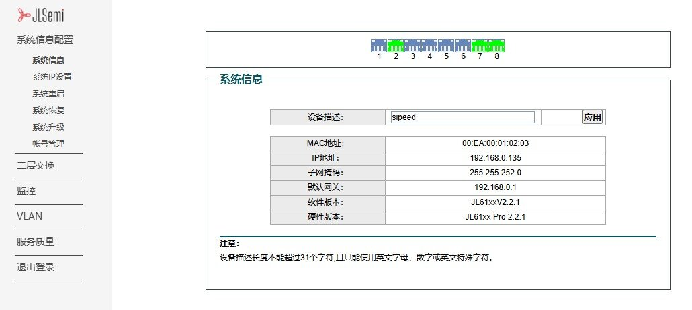
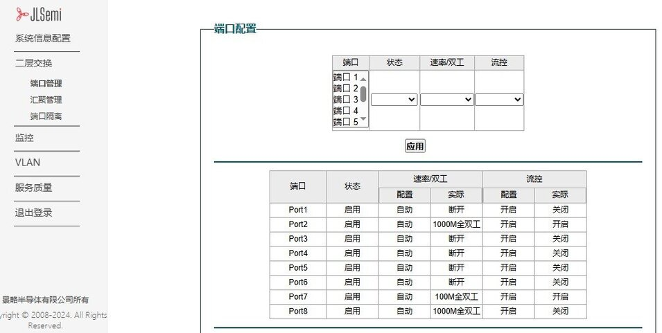
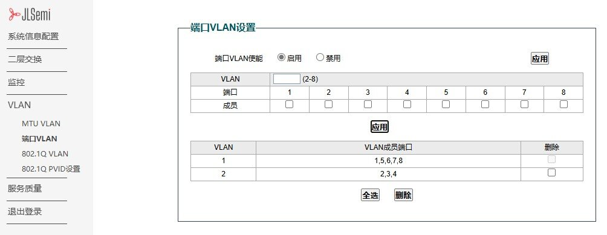
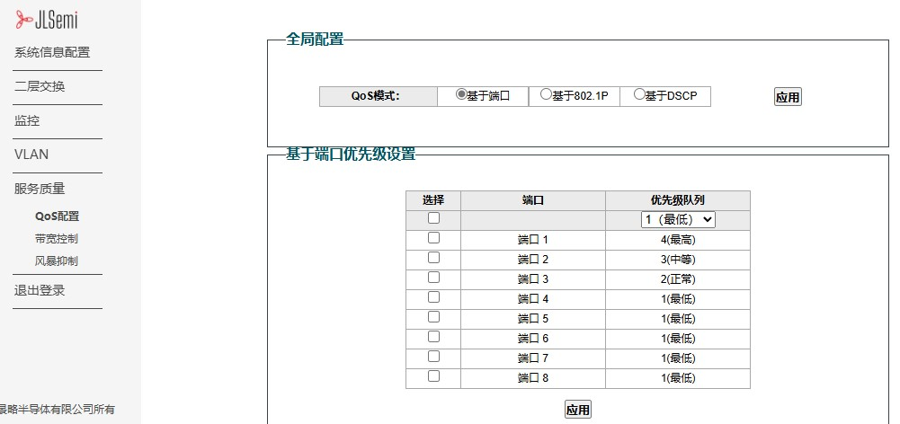
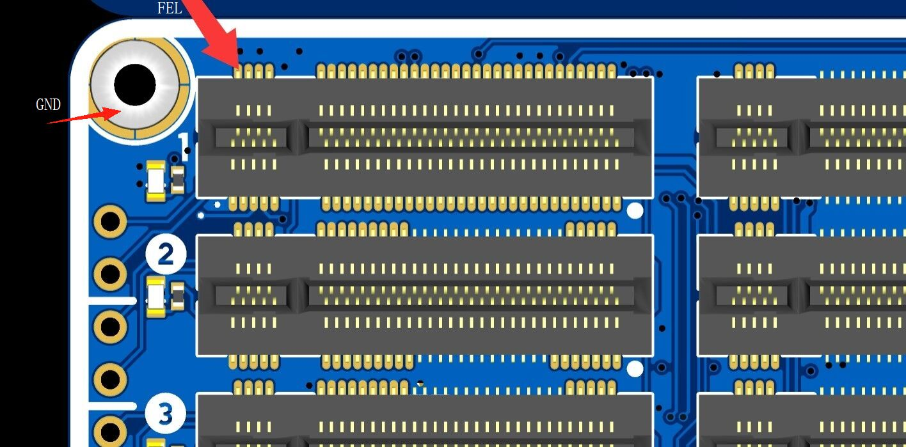

## 硬件安装

### LM3H 安装

先将散热片粘贴到主控芯片上，以提升散热效果。安装核心板时，请确保方向正确，以免损坏设备。



对准核心板上的金手指缺口与主板卡槽，使其对齐后轻轻放入，并均匀向下按压，直至听到 “喀哒” 声，确认核心板已牢固插入且无歪斜或松动。


如需拆卸核心板，请双手均匀握住核心板两侧，轻轻向上施力，避免单侧用力过大导致损坏。若核心板较紧，可先左右轻微晃动后再拔出，切勿生拉硬拽，以防损坏金手指或主板卡槽。

### CM4、CM5 安装

- 先将 CM4 / CM5 安装到转接板上；


- 再将转接板插入主板插槽。


>若使用 **CM5** 且需支持 **USB3.0**，请间隔一个槽位安装，确保 USB3 通道正常工作。

### M4N 安装

- 先将 M4N 核心板安装到转接板上；


- 再将转接板插入主板插槽。



### 风扇安装

将风扇对准底板上预留的安装孔位插入：


请确保风扇朝向正确，风向应朝向网口方向，以便更有效地带走 SOM 的热量：


使用螺丝将风扇牢固固定在底板上：


将风扇的电源排线插入底板上的风扇供电接口。请注意插头方向，确保红线为正极：


## 电源供应

NanoCluster 支持 USB-C PD 与 PoE 两种供电方式，支持双路热插拔 —— 即可同时连接 PD 与 PoE，在断开其中任意一方后系统依然稳定运行，支持在任意时刻插入或拔出任一电源。

默认支持 60W（20V/3A）PD 供电，使用带 e-Marker 的线材可达 65W（20V/3.25A）。推荐使用标配的 PD 适配器及优质 USB-C 线缆，以确保稳定供电。可选配 60W 峰值功率的 PoE 模块，持续输出功率约为 50W，适用于无独立供电接口的网络部署环境。 

### 最大支持配置（参考推荐功率）：

| 供电方式 | 最大支持配置                     |
|----------|----------------------------------|
| PD       | 支持 7× LM3H / CM4 / CM5 / M4N   |
| PoE      | 支持 7× LM3H / CM4；6× CM5 / M4N |
| SSD 安装 | 最多支持 4 个带 SSD 的 SOM（因空间限制）|
<br>

> **注：** CM5 / M4N 模块因功耗更高，在 PoE 模式下建议最多连接 6 个。

---

### PD 接口说明

设备通过 USB-C 接口支持 PD 协议供电，最大功率 65W。请使用原装适配器或符合 20V/3A 以上规格的电源适配器，确保设备正常启动并满载运行。


---

### PoE 模块安装说明

NanoCluster 可选配 PoE 模块，实现网络线供电，简化布线部署。请参考下图进行正确安装：


将 PoE 模块与主板插槽对齐后小心插入，确保连接牢靠，不松动。



>请使用符合标准的 PoE 交换机或 PoE 适配器，以保证稳定性和安全性。

## 烧录镜像

##### 核心板默认已预装系统，如需重新烧录系统，可按照以下步骤进行操作：

### LM3H 烧录

下载所需的固件镜像，并准备一台支持 USB OTG 的计算机及 USB 线。NanoCluster 目前使用的镜像与 Longan Pi 3H 兼容，可在此获取：[点击下载](https://wiki.sipeed.com/hardware/zh/longan/h618/lpi3h/3_images.html)。

将核心板插入 slot1 槽位后，使用 USB 线 连接 主板 OTG 接口（下方的接口）与计算机。按住 BOOT 按键，然后 上电或复位设备，即可进入 UMS 烧录模式。


准备好固件镜像后，打开 balenaEtcher，选择要烧录的镜像文件，确保核心板被识别为 U 盘，然后在 balenaEtcher 中选择目标设备。点击 “Flash” 按钮开始烧录，等待烧录完成后，安全弹出设备，断开 USB 连接并重启设备，即可进入新系统。


### CM4/CM5 烧录

1. 按照 [官方文档](https://www.raspberrypi.com/documentation/computers/compute-module.html#set-up-the-host-device) 安装 `rpiboot` 工具。

2. 按住转接板上的 BOOT 按键，将 USB OTG 接口连接到主机。

3. 主机识别到 **BCM2711 (BCM2712) Boot** 设备后，运行 `rpiboot`，稍等片刻会自动弹出一个 U 盘设备。

4. 打开 [Raspberry Pi Imager](https://www.raspberrypi.com/software/)，选择所需镜像并烧录到该设备上即可。

### M4N 烧录

可参考[系统烧录指南](https://wiki.sipeed.com/hardware/zh/maixIV/m4ndock/system-update.html)进行烧录

## 远程管理

主板配备一个网口用于连接交换机，集群内部设备通过交换机互联，并可通过 IP 地址进行控制和管理。

**如何获得设备的IP地址（以 LM3H 核心板为例）**:

先将网线连接至主板的网口，然后上电。预装的固件已启用 mDNS 服务，可在 PC 上启用 Avahi 服务，并使用 mDNS 扫描整个网络，即可获取 lpi3h 设备的 mDNS 域名信息。

``` bash
avahi-browse -art | grep lpi3h
```

然后使用:

``` bash
ssh sipeed@lpi3h-xxxx.local
```

即可连接（将 xxxx 替换为使用 avahi-browse 命令查看到的主机名）

> lpi3h 为 LM3H 默认的 mDNS 主机名前缀，若使用的是 CM4 或 CM5，请根据所烧录的系统镜像自行调整主机名。

## 串口连接

每个 SOM 都将系统串口引出至 2.54mm 插针，可通过串口转 USB 模块进行连接调试。

如需同时调试或控制多个 slot，推荐使用我们提供的 USB 转四串口扩展板。该扩展板将 slot3、slot5、slot6 和 slot7 的串口信号统一接入 slot1 的 USB 接口，便于集中管理与操作。


## 电源控制  

slot1~7 的复位脚由 slot1 通过 **I2C 扩展的 IO** 进行控制，可实现远程开关机。  

**LM3H 控制方法示例：**

```bash
# 复位交换机芯片（GPIO 0）
sudo gpioset gpiochip2 0=0 && sudo gpioset gpiochip2 0=1

# 复位 slot2（LM3H）
# 长按 8 秒实现关机
sudo gpioset gpiochip2 2=0 && sleep 8 && sudo gpioset gpiochip2 2=1

# 快速触发实现开机
sudo gpioset gpiochip2 2=0 && sleep 1 && sudo gpioset gpiochip2 2=1

# 复位 slot2（CM4/CM5）
sudo gpioset gpiochip2 2=0 && sudo gpioset gpiochip2 2=1
```

> `gpiochip2` 表示 GPIO 控制器编号，后面的 `x=0` 表示将编号为 x 的 IO 设置为低电平，`x=1` 设置为高电平。

| GPIO 编号 | 对应功能         |
|-----------|------------------|
| 0         | 交换机芯片复位   |
| 1~7       | slot1~slot7 复位 |

**CM4/CM5 控制方法示例：**

todo。

## 风扇调速

LM3H / CM4 / CM5 均支持风扇调速，默认情况下 LM3H 会根据 CPU 温度自动调节转速, CM4 和 CM5 官方镜像默认风扇全速运行。以下为各平台的控制方法。

如果需要手动调节风扇，可通过 SSH 连接到 slot1 设备，并执行以下命令：

### LM3H 调速

``` bash
echo disabled | sudo tee /sys/class/thermal/thermal_zone2/mode

echo 4 | sudo tee /sys/class/thermal/cooling_device0/cur_state
```

`cur_state` 取值范围为 0 ~ 4，对应不同转速。

如果要恢复自动调节，可使用以下命令:

``` bash
echo enabled | sudo tee /sys/class/thermal/thermal_zone2/mode
```

### CM4 调速

将以下内容添加到 /boot/config.txt:

```bash
dtoverlay=pwm-2chan,pin=12,func=4,pin2=13,func2=4
```

重启后执行：

``` bash
sudo pigpiod
```

Python 控制风扇：

```python
import pigpio

pi = pigpio.pi()

# 设置 PWM 频率和范围
pi.set_PWM_frequency(13, 50)
pi.set_PWM_range(13, 200)

# 设置风扇转速
pi.set_PWM_dutycycle(13, 0)     # 不转
pi.set_PWM_dutycycle(13, 200)   # 满速
```

### CM5 调速

Python 控制风扇：
```python
import RPi.GPIO as GPIO

GPIO.setmode(GPIO.BCM)
GPIO.setup(13, GPIO.OUT)

pwm = GPIO.PWM(13, 50)  # 50Hz 频率
pwm.start(0)            # 不转
pwm.start(100)          # 满速
```

## 交换机管理

### 简介

NanoCluster 搭载 JL6108 千兆交换机芯片，该芯片基于 **RISC-V** 架构，既可作为即插即用的傻瓜交换机使用，也可作为可本地管理的二层交换机，支持通过 Web 进行配置。主要功能包括：

- **系统管理**：显示系统信息、支持重启、恢复出厂设置、固件升级  
- **网络配置**：支持静态 IP 和 DHCP 动态 IP 配置  
- **端口管理**：端口启用/禁用、链路速率设置、流控管理  
- **端口汇聚**：支持端口绑定，提高带宽利用率  
- **安全与隔离**：端口隔离、防止数据泄露  
- **流量监控**：端口 MIB 统计、流量分析  
- **环路保护**：防止网络环路，提升网络稳定性  
- **VLAN 配置**：支持 MTU VLAN、基于端口的 VLAN、802.1Q VLAN、PVID 设置  
- **QoS 配置**：基于端口、PCP、DSCP 进行流量优先级管理  
- **带宽与风暴控制**：支持基于端口的带宽限制与广播风暴抑制

### 使用教程

1. **确保设备连接**  
   确保 NanoCluster 已上电，并通过网线将板载网口与管理主机相连。

2. **配置 IP 地址**  
   交换机的默认 IP 地址为 **10.10.11.10/24**，请确保管理主机的 IP 地址与其处于同一网段，例如 **10.10.11.x**（x 取值范围：1-254，且不能为 10），子网掩码设为 **255.255.255.0**。  

   

3. **访问管理界面**  
   在浏览器地址栏输入 `http://10.10.11.10` 并回车，即可进入交换机的登录界面。  

   

4. **登录管理系统**  
   在登录界面输入 **管理员账号和密码**（默认均为 `admin`），然后点击 **登录**，进入交换机管理界面首页。  

   

### 基本配置

#### 端口管理
JL6108 交换机提供端口状态管理功能，支持 **端口启用/禁用**、**速率设置**、**流控管理**。
- **启用/禁用端口**：可在 **端口管理** 页面找到目标端口，选择“启用”或“禁用”  
- **修改端口速率**：支持 10Mbps / 100Mbps / 1000Mbps 三种模式  
- **流控**：可开启端口流控，防止数据丢失  



#### VLAN 配置
VLAN（虚拟局域网）用于划分不同的网络区域，防止广播风暴，提高网络安全性。

##### 配置端口 VLAN

1. **进入端口 VLAN 界面**  
   在 Web 管理界面，依次进入：`VLAN` >> `端口 VLAN`，进入 VLAN 配置页面。

2. **启用端口 VLAN 功能**  
   勾选 **“端口 VLAN 使能”** 选项，并点击 **`应用`** 按钮。

3. **创建 VLAN 2 并配置端口成员**  
   - 在 **VLAN ID** 输入框中输入 **`2`**  
   - 勾选 **端口 2 ~ 4**  
   - 点击 **`应用`** 按钮以保存配置  

4. **查看端口成员表**  
   配置完成后，**端口 2 ~ 4 将自动从 VLAN 1 中移除**，并加入 VLAN 2。  

   

#### QoS 配置（流量优先级）
QoS 用于保障高优先级流量（如视频会议、VoIP）的稳定性：
1. **进入“QoS 设置”**  
2. 选择 **基于端口/802.1P/DSCP** 的 QoS 策略  
3. 设置 **高/中/低优先级队列**  
4. **保存设置**，QoS 规则生效  



### 更多配置

JL6108 交换机还支持更多高级功能，详细配置说明，请参考官方手册。

[点击此处查看完整手册](https://dl.sipeed.com/shareURL/Cluster/NanoCluster/06_Switch_JL6108)

我们提供基于 **RISC-V** 架构的 **JL6108 SDK**，用户可以从以下链接下载 SDK 并进行自主开发。

[JL6108 SDK](https://dl.sipeed.com/shareURL/Cluster/NanoCluster/06_Switch_JL6108)

## 常见问题排查（FAQ）

### 设备无法开机 / 无法进入系统
确保使用至少支持 PD 20V 输出的电源适配器，避免使用主机 USB 供电，否则可能导致设备无法正常启动。检查电源输入接口旁的绿色指示灯是否亮起，若无反应，可能是电源适配器或供电线路问题。观察每个 slot 对应的蓝色电源指示灯，判断系统是否正常启动。

如果 **LM3H** 无法进入系统，可按住 BOOT 按键后上电或复位设备，检查是否进入 UMS 模式，并通过磁盘管理确认是否识别为 U 盘。若系统损坏或无法进入，可以重新[烧录镜像](https://wiki.sipeed.com/hardware/zh/cluster/NanoCluster/use.html#烧录镜像)；若无法进入 UMS 模式，请尝试[异常刷机](https://wiki.sipeed.com/hardware/zh/cluster/NanoCluster/use.html#异常刷机（LM3H）)。

若 **CM4/CM5** 无法正常启动系统，可参考[烧录镜像](https://wiki.sipeed.com/hardware/zh/cluster/NanoCluster/use.html#烧录镜像)部分重新烧录后再进行测试。

### 网络连接异常（无法获取 IP）
如果成功进入系统但网络连接异常，无法获取 IP，请确保先插入网线再上电。交换机会在设备上电时检测网络接口，若上电后再插网线，可能导致接口无法正常识别。

### 异常刷机（LM3H）

如果因某些原因导致 U-Boot 损坏，设备无法正常进入 UMS 模式，可以通过 Fel 模式 手动恢复。使用 sunxi-fel 或 xfel 工具，将 U-Boot 加载至内存并启动 UMS 模式，然后进行刷机。

#### 进入 fel 模式

短接 slot1 的该处引脚与 GND，然后上电即可进入 FEL 模式（后续版本可能增加按键控制）。



#### 使用 sunxi-fel

编译安装
``` bash
git clone https://github.com/linux-sunxi/sunxi-tools.git
cd sunxi-tools
make tools
sudo make install
```

烧录 U-Boot
``` bash
sudo sunxi-fel uboot /path/u-boot-sunxi-with-spl.bin
```

执行完成后，设备应能正常进入 UMS 模式，此时可继续烧录系统镜像。

#### 使用 xfel

编译安装
``` bash
sudo apt install libusb-1.0-0-dev
git clone https://github.com/xboot/xfel.git
cd xfel
make
sudo make install
```

烧录 U-Boot
``` bash
xfel ddr lpddr4
xfel write 0x4a000000 /path/u-boot-dtb.bin
xfel exec 0x4a000000
```

执行完成后，设备应能正常进入 UMS 模式，然后进行系统镜像烧录。
