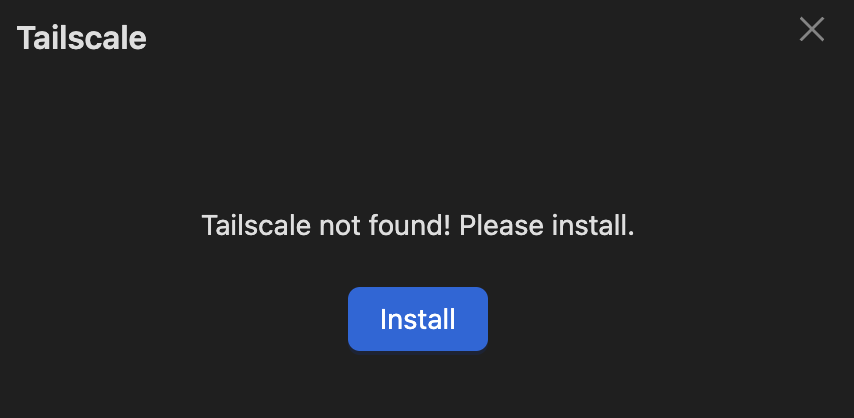

> **推荐将 NanoKVM 与 Tailscale 配合使用，来实现公网访问远程主机的目的。**

*注意：v1.0.0 版本的镜像不支持 Tailscale。如果你的 NanoKVM 镜像版本是 v1.0.0，请先[更新镜像](https://wiki.sipeed.com/hardware/zh/kvm/NanoKVM/start/flashing.html)。*

目前 NanoKVM 已经内置了 Tailscale，只需要简单的操作即可开始使用。
有两种配置 Tailscale 的方式：在浏览器中配置和在终端中配置。
推荐在浏览器中进行配置。如果你需要更多的自定义功能，也可以在终端中进行配置。

## 在浏览器中配置

1. 在浏览器中输入 NanoKVM 的 IP 并访问；
1. 点击设置 - Tailscale：

    

1. 如果提示 Tailscale 未安装，请点击安装，并等待安装完成。如果显示已安装，则进行下一步：

    

1. 点击登录，等待 Tailscale 启动并生成登录链接（该操作只需要执行一次，Tailscale 会开机自启）：

    

1. 登录链接生成后，浏览器会自动打开该链接。如果未自动跳转，请手动访问生成的链接。然后登录 Tailscale 账号，并点击 `Connect` 将 NanoKVM 加入到你的账号。

    

1. 现在可以在你的 Tailscale 账号下看到 NanoKVM 了。在公网环境中，运行 Tailscale，然后在浏览器中访问 `100.79.236.88 (替换为你的 Tailscale IP)`即可：

    

## 在终端中配置

1. 通过 SSH 登录到 NanoKVM；
2. 执行 `tailscale version` 检查 tailscale 是否已经安装。如果未安装，则手动进行安装：
    - 下载 [Tailscale](https://pkgs.tailscale.com/stable/tailscale_latest_riscv64.tgz) 并解压；
    - 将 `tailscale` 文件移动到 `/usr/bin/` 目录；
    - 将 `tailscaled` 文件移动到 `/usr/sbin/` 目录。
3. 执行 `/etc/init.d/S98tailscaled restart` ，启动 tailscale 服务；
4. 执行 `tailscale login` ，等待登录链接生成，然后在浏览器中访问生成的链接；
5. 在浏览器中点击 `Connect` ，将 NanoKVM 加入到你的 Tailscale 账户；
6. 操作完成！现在就可以通过 Tailscale 访问 NanoKVM 了。
