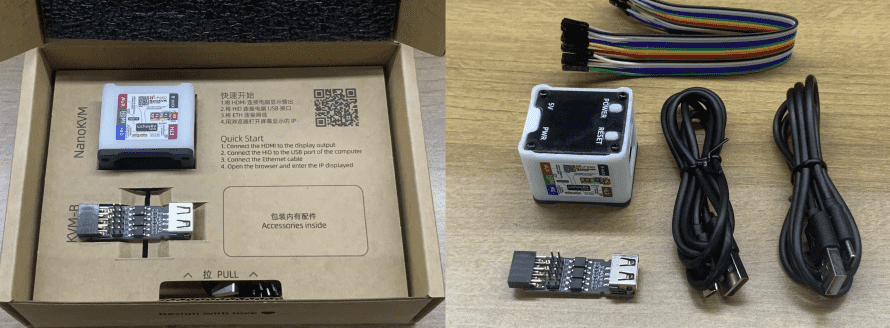
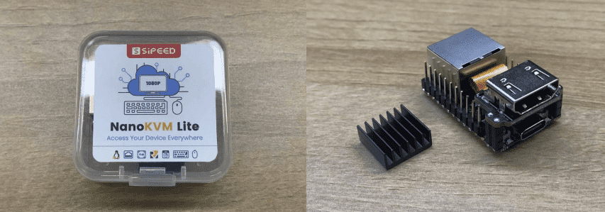
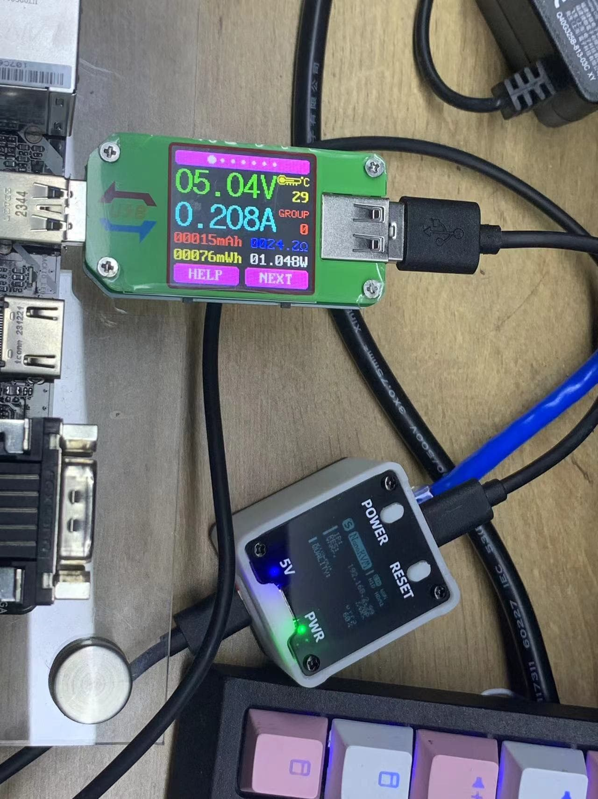
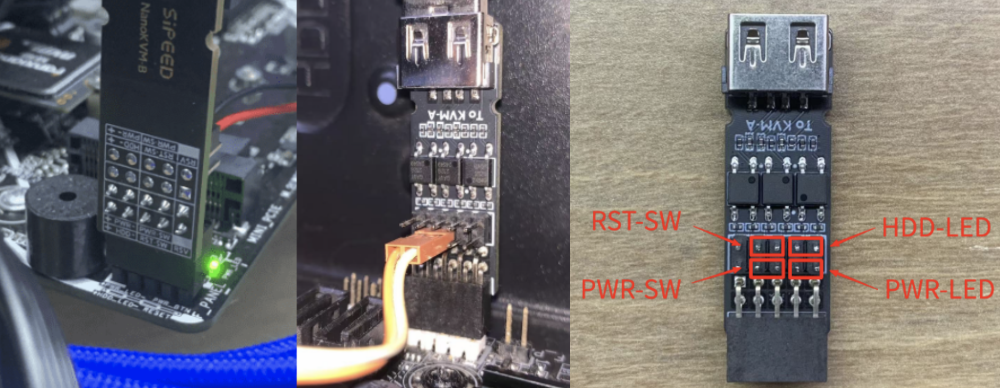

## 开箱

Full版包含 NanoKVM（带外壳，带卡）、KVM-B板、USB A to C 线 *2、杜邦线。

Lite版包含 NanoKVM（不带外壳和TF卡） 、散热片。

## 接口介绍

+ **Full 版本可看到三个 USB Type-C 接口，名称和功能如下**

  + HID 接口（也称PC-USB），位于 HDMI 接口下方，用于连接主机，模拟键鼠、U盘、RNDIS设备
  + AUX 接口，位于 HDMI 接口上方，辅助供电
  + KVM-B 接口（也称ATX-Power），位于网口上方，连接 KVM-B 提供电源控制功能

## 供电

+ NanoKVM 支持普通 USB 的 5V 供电，功耗约1W，部分老型号主板可能存在供电电流过小的问题，需要通过 AUX 接口额外供电。

+ 部分主板 BIOS 可能默认设置为关机 USB 断电，为确保 NanoKVM 常供电，请在 AUX 接口上额外供一路5V电源。

+ NanoKVM USB CC 接口下拉5.1K电阻，可使用正规 PD 充电头供电。部分劣质电源未经协商直接输出12V电压，会将NanoKVM直接烧坏。

注：首批内测版 AUX 接口不带 CC 的下拉电阻，无法使用 C-C 的 PD 充电头供电，请使用常规 5V USB 电源适配器。

## 接线

NanoKVM-Full版接口示意图如下，Lite版仅包含 USB-C、HDMI和网口，可以参考Full版接线。

+ 使用一条 USB C to A 数据线连接远程主机和 NanoKVM 的 PC USB 接口（位于 HDMI 接口下方）

+ 一条HDMI（标准尺寸）连接远程主机和 NanoKVM 的 HDMI 接口

  

+ 使用网线连接 路由器/交换机 与 NanoKVM

+ 再使用一条 USB C to A 数据线连接 KVM-B 板和 NanoKVM 的 ATX 接口（位于网口上方）

  正式版KVM-B板自带主板通用的9Pin排母接口，可以直接插在主板上，机箱的开机按键、Power LED 等接口可接到 KVM-B 的排针上，参考示意图（此处机箱仅连接开机线）：

  

  > 注:版本号为30132的KVM-B板不能用机箱自带9-Pin排母直接连接板上的排针,需按照上图使用附赠的公对母排线连接

  内测版KVM-B板与主机9针接口连线如下图，双排排针上下联通，另一排可连接机箱的开机按键、Power LED 等接口
  > 注意:早期内测板NanoKVM重启时会短暂拉高RESET控制脚,导致连接的电脑重启,为避免这一问题,请不要连接RESET跳线,后期正式版已修复

  
    

## 更新

### 更新镜像

> **Lite 版本需要准备 TF 卡并且烧录镜像后才能开始使用！**

Full 版本出厂时已经烧录了镜像，可以跳过此步骤。

镜像会不定期更新。建议更新到最新版本镜像，以获取更好的使用体验。

具体操作方式请参考 [烧录镜像](https://wiki.sipeed.com/hardware/zh/kvm/NanoKVM/system/flashing.html)。

### 更新应用

新的应用往往带来更多功能或修复某些重要漏洞，建议您将 NanoKVM 应用更新到最新版本，具体操作方式请参考 [更新应用](https://wiki.sipeed.com/hardware/zh/kvm/NanoKVM/system/updating.html)。

## 基础操作

### 如何获取IP地址

Full版NanoKVM自带OLED显示屏，联网之后会在显示屏第一行显示IP地址；

Lite版用户请参考[获取IP](https://wiki.sipeed.com/hardware/zh/kvm/NanoKVM/system/updating.html#%E8%8E%B7%E5%8F%96-IP)

### 查看远程桌面

浏览器直接输入获取的IP，进入登录页面，默认账号密码为admin、admin，登录后建议**先检查更新**（设置 -> 检查更新），详细步骤可参考 [更新应用](https://wiki.sipeed.com/hardware/zh/kvm/NanoKVM/system/updating.html)。

Lite版用户，或Full用户重新烧卡登录后页面上无远程画面，请先升级应用后刷新网页，即可开始使用

### 修改账号密码

**为保障您的信息安全，请在测试功能正常后修改账号密码**

### ATX电源控制

Full 版套餐内包含了 NanoKVM-A/B 板，用于控制和查看主机开关机状态。

+ 顶板上的 5V LED（蓝色）指示 NanoKVM 的供电情况；
+ PWR LED（绿色）为主机的电源指示；
+ POWER按键作用同主机的电源按键，可以控制主机的开关机；
+ RESET按键用主机的重启按键，开机状态下按下RESET将强制重启主机
+ 网页端也可以查看并控制，参考[用户指南](https://wiki.sipeed.com/hardware/zh/kvm/NanoKVM/user_guide.html)

