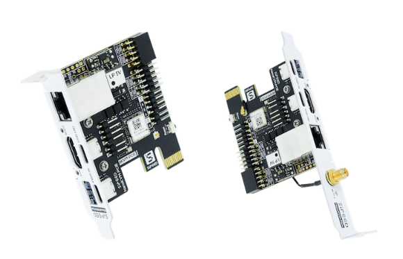

## 简介

NanoKVM-PCIe 是 NanoKVM 的新形态, 自带 PCIe 挡板, 可以固定在机箱内部, 为台式机用户提供更好的体验。

NanoKVM-PCIe 在 NanoKVM-Cube的基础上添加可选的 WiFi, PoE功能(选配)；自带 PCIe 插槽,可以从主板 PCIe 插槽取电；此外, 有线连接(ETH)也更加稳定, 符合更专业的需求。

NanoKVM 系列产品包含一个 HDMI 输入接口，可以被电脑识别为显示器，捕捉电脑画面；一个 USB2.0 接口连接电脑主机，可被识别为键盘鼠标触摸板等HID设备，同时使用TF卡多余存储空间，挂载为一个U盘设备；全系标配一个百兆网口，用于视频和控制信号等的网络传输。PCIe版 NanoKVM 标配一个0.49英寸OLED, 实时显示各种状态信息, WiFi配网等各种信息。

为满足用户不同需求，NanoKVM-PCIe 提供 WiFi 和 PoE 两个可选配模块, 购买时可自由搭配

## 使用场景

+ 服务器管理：用于实时监控服务器，获取服务器运行状态，并对其加以控制；
+ 远程桌面、开关机：NanoKVM 摆脱主机必须联网和系统软件的限制，作为主机外置硬件，直接提供远程控制的功能；
+ 远程装机：NanoKVM 模拟 U盘设备，可挂载装机镜像安装系统，也可进入BIOS对电脑设置；
+ 远程串口：NanoKVM 引出两组串口，可配合IPMI使用，或连接其他开发板使用网页串口终端交互，此外用户可自行拓展更多配件
+ 双电脑协同操作

## 参数

| 产品 | NanoKVM (PCIe) | NanoKVM (Full) | PiKVM V4 |
| --- | --- | --- | --- |
| 计算单元                | SG2002(RISCV) | LicheeRV Nano(RISCV) | CM4 (ARM) |
| 分辨率                  | 1080P @ 60fps | 1080P @ 60fps | 1080P @ 60fps |
| 视频编码                | MJPEG, H264 | MJPEG, H264 | MJPEG, H264 |
| 视频延迟                | 90～230ms | 90～230ms | 100～230ms |
| UEFI/BIOS               | ✓ | ✓ | ✓ |
| 模拟USB键鼠  | ✓ | ✓ | ✓ |
| 模拟USB存储  | ✓ | ✓ | ✓ |
| IPMI      | ✓ | ✓ | ✓ |
| Wake-on-LAN | ✓ | ✓ | ✓ |
| Tailscale | ✓ | ✓ | ✓ |
| WebSSH | ✓ | ✓ | ✓ |
| 自定义脚本 | ✓ | ✓ | - |
| ETH | 100M/10M | 100M/10M | 1000M/100M/10M |
| PoE | 选配 | 仅外部连接 | 1000M/100M/10M |
| WiFi | 选配 | - | ✓ |
| ATX电源控制 | 可直连机箱内9Pin电源针脚 | USB接口IO控制板 | RJ45接口IO控制板 |
| OLED显示 | 64*32 0.49" white | 128x64 0.96" white | 128x32 0.91" white |
| 串口终端 | 2路 | 2路 | - |
| Micro SD卡 | 有，开机即用 | 有，开机即用 | 有 |
| 功耗 | 0.2A@5V | 0.2A@5V | Peak 2.6A@5V |
| 电源输入 | 多种供电模式 | PC USB即可供电   也支持额外辅助供电 | 需要DC 5V 3A供电 |
| 散热 | 静音无风扇 | 静音无风扇 | 需要风扇主动散热 |
| 尺寸 | 66x57x18mm(不含挡板) | 40x36x36mm | 120x68x44mm |

## NanoKVM-PCIe 资料

NanoKVM 与 Sipeed [LicheeRV Nano](https://wiki.sipeed.com/hardware/zh/lichee/RV_Nano/1_intro.html) 使用相同SOC，希望二次开发的小伙伴可在[这里](https://wiki.sipeed.com/hardware/zh/kvm/NanoKVM/development.html)查看更多资料

NanoKVM Cube/PCIe 软件现已完全开源：[KVM应用开源位置](https://github.com/sipeed/NanoKVM)、 [镜像开源位置](https://github.com/sipeed/LicheeRV-Nano-Build/tree/NanoKVM)

> NanoKVM 镜像在LicheeRV Nano SDK 和 MaixCDK 基础上构建，可以兼容使用 LicheeRV Nano 的资料，反之LicheeRV Nano 或其他 SG2002 产品无法使用KVM软件。如果您想在 NanoKVM 上构建 HDMI 输入相关应用，请与我们联系，以获得技术支持。

NanoKVM-Cube 和 NanoKVM-PCIe 共用同一套镜像和应用, 自动适配不同的硬件版本

+ [NanoKVM 镜像下载](https://github.com/sipeed/NanoKVM/releases)

## 购买入口

[淘宝官方购买地址]() (待更新)
[速卖通购买地址]()(待更新)
[预售页面](https://sipeed.com/nanokvm/pcie)

## 产品反馈

如果您在使用过程中有任何问题或建议，请通过以下渠道和我们反馈：

+ [Github issues](https://github.com/sipeed/NanoKVM) 
+ [MaixHub 论坛](https://maixhub.com/discussion/nanokvm)
+ QQ 交流群: 703230713

