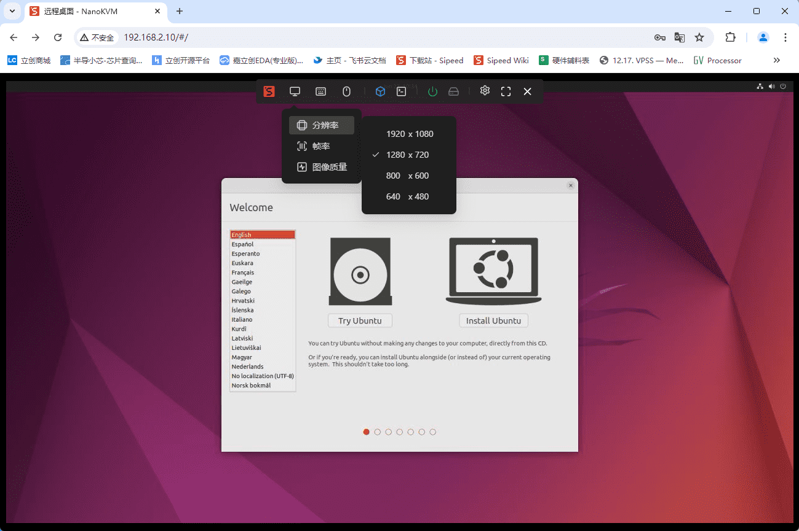
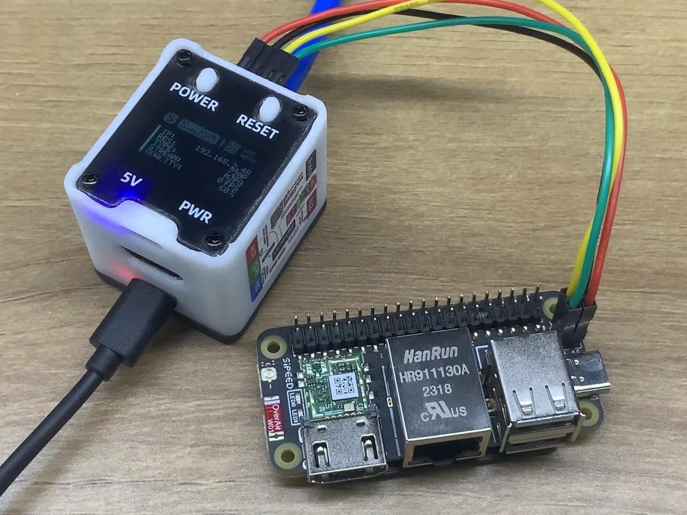

## OLED界面

在 NanoKVM-PCIe 上, OLED有两种界面: 主界面和WiFi配置界面,通过长按BOOT(2s)切换两个界面

主界面:

+ 显示网线、USB、HDMI 连接状态，连接后图标将反色显示;
+ IP: 连接网线后 NanoKVM 默认自动获取IP，并显示在 OLED 上，WiFi版本 IP 将自动切换;
+ 分辨率: 将显示HDMI物理分辨率,如1920*1080
+ FPS: 显示实时传输帧率
+ 主界面提供 OLED 休眠功能, 以防止 OLED 烧屏, 短按 BOOT 即可关闭或打开 OLED

WiFi配置界面(没有选配WiFi的版本无WiFi配置界面)

+ 根据WiFi配置流程依次显示:WiFi AP 正在创建->WiFi二维码->Web二维码
+ WiFi连接成功后会自动退出该界面
+ 详细WiFi配置流程请参考[配置WiFi](https://wiki.sipeed.com/hardware/zh/kvm/NanoKVM_PCIe/quick_start.html#WiFi-配网)

## 管理页面功能

悬浮栏从左到右依次为：图像设置、屏幕键盘、鼠标样式、镜像挂载、自定义脚本、KVM网页终端、WOL、ATX控制/指示、设置、全屏、隐藏悬浮栏。

### 分辨率、格式、帧率、图像质量设置

+ NanoKVM 支持 1080P、720P、600P、480P 的图像传输，在图像设置->分辨率中可以选择不同的分辨率。越大的分辨率所占用带宽越大、实时帧率越小, Auto模式下传输分辨率将跟随主机HDMI物理分辨率。
  + 注：此处仅修改图像的传输大小，不会改变 HDMI 输入的图像尺寸，如需修改，请前往主机系统的设置菜单进行设置。

+ 格式设置: 当前, NanoKVM 支持两种格式: MJPEG和H264
  + MJPEG格式传输每一帧图像, 图像质量相对较高, 延迟比较确定, 但流量消耗比较高
  + H264格式传输视频流数据, 传输数据体积小, 延迟低,在高画质下比较明显

+ 帧率设置选项用于修改传输的最大帧率，可以限制网络带宽的占用，但帧率越低，画面越卡，请根据网络情况合理配置。Full版用户在OLED上可看到视频的实时帧率。

+ 图像质量选项可以修改画面的压缩比例，当您认为画面较卡，延迟较高时，可以适当调低图像质量。
  + 在MJPEG格式下, 低,中,高,无损,分别代表图像压缩比为: 50%, 60%, 80%, 100%
  + 在H264格式下, 低,中,高,无损,分别代表传输码率为: 1000Kbps, 2000Kbps, 3000Kbps, 5000Kbps

### 虚拟键鼠使用

+ NanoKVM 的 USB 接口模拟出了键鼠设备。打开浏览器页面后，系统将自动捕获键鼠输入，并将操作实时同步到 NanoKVM 连接的主机。用户可以选择隐藏鼠标或改变在画面上显示的样式。
+ 对于不方便使用键盘的用户，我们提供了屏幕键盘，点击悬浮栏的键盘图标即可唤出屏幕键盘。
+ 少数情况下HID键鼠无法控制主机, 请点击重置HID后再试
+ 部分 BIOS 要求鼠标必须使用相对位移模式, 请在网页->鼠标模式中修改
+ 部分 BIOS 要求键鼠必须使用带有BIOS标记的模式,请在网页终端中执行 `/touch /boot/BIOS && reboot`

### ISO镜像挂载以及远程装机

+ Nano KVM的 USB-C 端口除模拟键鼠设备外，还模拟了一个U盘设备，挂载了TF卡内的一部分存储空间，用于装机等需求，该U盘默认格式化为exFAT格式，Full版NanoKVM内置TF卡，模拟出的U盘大小约21G。

+ 与普通U盘不同，NanoKVM的虚拟U盘内可同时存放多个镜像，开机之前可以通过 web 页面的选项选择要安装的系统镜像进行挂载。

用户需提前下载待安装的镜像（通常以.iso结尾），将 NanoKVM USB-C 插入电脑，将下载好的镜像直接复制到U盘内（可复制多个系统），即可拔出。

按上述步骤连接远程主机与Nano KVM，在浏览器登录系统后，点击光盘图标，选中待安装的系统，即可实现ISO挂载

接下来开始装机操作，点击`开机（短按）`，迅速按键盘上的F11键（不同主机按键可能不同，请参照主机说明），选择对应的镜像启动并完成装机流程。

注：

+ 虚拟U盘功能默认打开，如果不需要可通过点击`设置`->`虚拟U盘`关闭。
+ 请先在主机上安全弹出原有的21G虚拟U盘后再挂载镜像,以免数据丢失
+ 虚拟U盘也可以当作普通U盘使用，web界面未选中任何镜像时，默认挂载整个21G的虚拟U盘。
+ 用户也可使用常规的烧卡方式烧录镜像，不推荐
+ 镜像拷入 NanoKVM 的速度受到 USB2.0 传输速度和 SG2002 写卡速度的限制，可能会比较慢，用户可将TF卡取出，插入电脑，[解除隐藏](https://jingyan.baidu.com/article/e4511cf34faece2b845eaf34.html)TF卡的第三个分区，直接将镜像拷入其中。
+ 虚拟U盘同时挂载到NanoKVM的 `/data` 目录，用户可在 NanoKVM 终端内直接读写该分区
+ 设置中的取消虚拟U盘操作将强制弹出U盘,请先安全弹出U盘后再设置,以免数据丢失

### 网页终端

+ 用户点击悬浮栏的`终端`->`NanoKVM 终端`图标，即可打开网页终端，无需ssh直接访问 NanoKVM 系统
+ 当 NanoKVM 断网重连或系统重启后，网页终端界面会提示重新登录，账号`root`，密码`root`

### 串口终端

NanoKVM 基于 LicheeRV Nano 构建，RVNano 核心板共有3个串口，UART0默认用于输出系统log，在 NanoKVM Full 版中，引出了 UART1/2，用户可自行拓展功能（第一批内测版仅在外壳处开孔）

点击管理页面的`终端`，选择`串口终端`，选择使用的串口，填写波特率，点击开始后即可使用

注：串口终端功能使用 WebSSH + picocom 搭建，用法同 picocom

### RNDIS

NanoKVM 的 USB 会默认虚拟出 RNDIS USB网卡（从设备），当 NanoKVM 服务异常时可用于系统维护，请参照[这里](https://wiki.sipeed.com/hardware/zh/kvm/NanoKVM/system/updating.html#%E9%80%9A%E8%BF%87-usb-rndis-%E7%BD%91%E5%8F%A3%E8%8E%B7%E5%8F%96)连接电脑，更多用法请自行探索。

若不使用 RNDIS 功能，可点击`设置`->`RNDIS`关闭。

### ATX电源控制

+ 在悬浮栏右侧，有电源和硬盘图标，正常情况下是灰色状态，开机后电源图标变绿。
+ 点击电源图标可看到重启键、电源键（长/短按）
+ Full版的ATX控制板受延长线芯数限制，只引出电源、重启按键和电源灯，硬盘灯不亮属正常现象。

### 设置

+ 切换中英文
+ 关于NanoKVM：点击打开Wiki
+ 检查更新：当有可用更新时，用户可点击更新，约15s左右，网页自动刷新重新登录即可更新完成。

### 更多功能敬请期待

## 硬件与结构

NanoKVM-PCIe 包含 主板 和 USB接口板 两个部分, 通过2P+4P的排线连接, USB接口板仅将 USB-HID 和 USB-PWR 接口引出, 当需要 USB-HID 接主板内部针脚时,可将4P排线断开

PCIe全高挡板通过两颗螺丝固定在主板上,如需替换半高挡板,请拧下螺丝后替换

受限于PCIe规范中接口的位置, HDMI和下方USB距离较近, 部分HDMI胶壳较厚, 可能会和 USB 接口干涉, 请用包装内附赠的 HDMI 线缆连接

