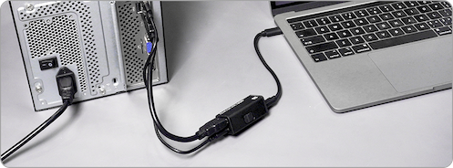
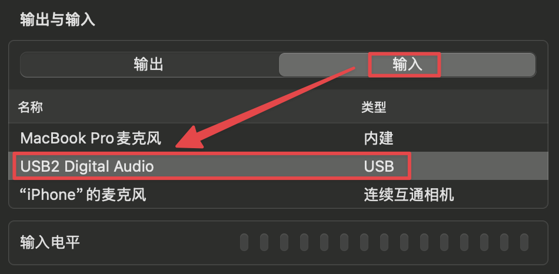
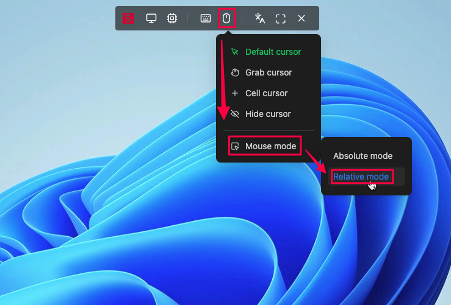

## 接口介绍

## 接线

使用 USB3.0 或 TypeC 线连接 NanoKVM-USB 与 Host 主机。

使用 HDMI 线连接 NanoKVM-USB 与 Target 主机。

使用 USB3.0 线连接 NanoKVM-USB 与 Target 主机。

## 网页使用教程

### 打开网页

使用 Chrome 浏览器访问 `https://usbkvm.sipeed.com`。

> 请使用桌面端 Chrome 浏览器，且版本号需要大于 89。
>
> 由于使用了 [Web Serial API](https://developer.mozilla.org/en-US/docs/Web/API/Serial)，移动端 Chrome 和其它不支持该特性的浏览器均无法使用键鼠。

### 授权

NanoKVM-USB 会模拟成 USB 摄像头，用于传输视频和音频。因此网页首先需要获取摄像头使用权限。

> 如果您拒绝了授权，或者想关闭授权，可以选择重置所有权限。
>
> 

### 选择 USB 设备

在获取授权后，网页会显示一个选择 USB 设备的弹窗。我们需要在这里选择两个设备：

1. USB 摄像头：用于视频和音频的输入；
2. 串口设备：用于发送键盘和鼠标数据。

#### USB 摄像头

点击下拉框，选择以 `USB Video` 格式命名的摄像头设备。选择设备后网页就会开始显示视频画面。

#### 串口设备
>
> 如果当前浏览器不支持串口，则不会显现该按钮。此时网页仅有视频传输功能，无法使用键盘和鼠标。

点击选择串口按钮，会弹出所有可用的串口设备列表，从中选择对应的串口设备。

> Windows 为`COMx`格式，macOS为`USB Serial`格式，linux一般为`/dev/ttyUSBx`格式

设置完成！到这里就可以开始正常使用了。

### 音频

如果网页没有自动播放声音，则需要用户手动设置。这里以 Mac 控制 Windows 为示例：

#### Target 主机

在 Target 主机（Windows）中，选择 NanoKVM 作为**音频输出**设备。

音频设备的名称和是否连接环出设备有关：

- 如果没有接环出设备，则音频设备名称为 `HDMI TO USB`；
- 如果连接了环出设备，则音频设备名称为该设备的名称。

#### Host 主机

在 Host 主机（Mac）中，选择 NanoKVM 作为**音频输入**设备。

音频设备的名称格式一般为 `USB Digital Audio`。

### 鼠标

鼠标默认使用`绝对模式`。在 BIOS 界面或某些系统中，该模式可能无法正常工作，请切换到`相对模式`后使用。

