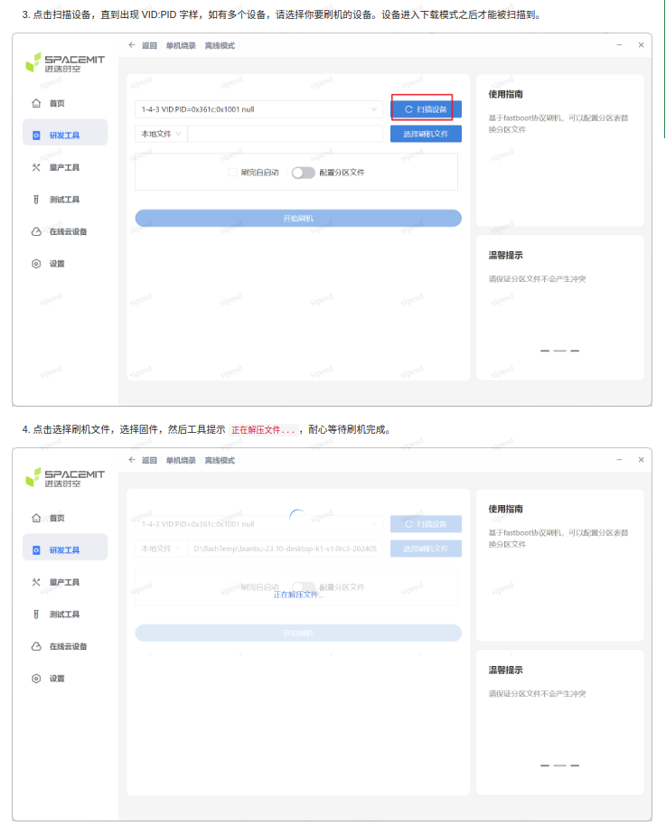

## 获取镜像
### Bianbu 镜像
 
LicheePi3A 已被进迭官方bianbu镜像支持   
可以到[进迭官方镜像站](https://archive.spacemit.com/image/k1/version/bianbu/)下载，注意请下载v1.0.11以上的镜像


### Fedora 镜像


### openKylin 镜像


### Deepin 镜像
https://ci.deepin.com/repo/deepin/deepin-ports/cdimage/20240815/riscv64/

## 获取烧录工具

LicheePi3A可使用fastboot或者titian烧录工具烧录。

[Windows](https://cloud.spacemit.com/prod-api/release/download/tools?token=titantools_for_windows_X86_X64)
[Linux](https://cloud.spacemit.com/prod-api/release/download/tools?token=titantools_for_linux_64BIT_APPIMAGE)

进迭官网下载最新工具：
https://developer.spacemit.com/#/Documentation

烧录指南：
https://bianbu.spacemit.com/installation_and_upgrade

## 烧录eMMC
### 使用 Titan Flasher 刷机
板卡在启动时检测到BOOT键按下即可进入烧录模式，就是说，先按住BOOT键，再插电或者短按RESET键，即可进入烧录模式。   
 
 
 

### 使用Fastboot 刷机
以 .zip 结尾的 zip 固件，解压后可以用 fastboot 刷机。

**前提**
1. 设备已插上 USB 数据线，连接到 PC；
2. 电脑安装好 fastboot 命令。
**刷机步骤**
1. 解压固件
2. 下载刷机脚本 [flash-all.zip](https://archive.spacemit.com/image/k1/flash-all.zip)，并解压到固件目录；
3. 进入 fastboot 模式
```reboot fastboot```

等待设备重启并进入 fastboot 模式：

1. 运行 flash-all 脚本，等待刷机完成；
2. Linux PC 运行 flash-all.sh，注意先赋予可执行权限；Windows PC 运行 flash-all.bat；
3. 刷机完成，重新上电即可进入系统。

## 烧录TF卡
以 img.zip 结尾的固件为 sdcard 固件，解压后可以用 dd 命令或者 balenaEtcher 写入 sdcard。注意此固件不适用于 eMMC。

**步骤**
1. 将固件写入 sdcard；
2. 将 sdcard 插入设备；
3. 设备上电开机即可启动。

## LPi4A 兼容设置
注意，如果你使用的是LPi4A的底板，由于底板差异会导致默认镜像下USB A口无法使用，首次使用需要先连接串口或者网络，进入设备终端，替换dtb    
在/boot/spacemit/6.1.15/下，将 k1-x_lpi3a_4a.dtb 覆盖到为 k1-x_lpi3a.dtb，重启即可使用USB

## LCD支持
默认镜像仅开启了HDMI输出，如果需要LCD支持，则需要替换dtb   
在/boot/spacemit/6.1.15/下，将 k1-x_lpi3a_lcd.dtb 覆盖到为 k1-x_lpi3a.dtb，重启即可使用LCD   
注意此dtb必须接LCD才能使用  


