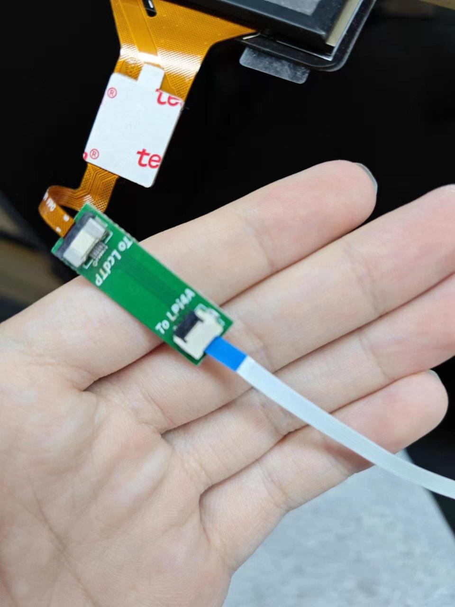

## SoC 相关
 
### CPU 运行频率

`sudo cat /sys/devices/system/cpu/cpu*/cpufreq/cpuinfo_cur_freq `
单位为 KHz   
注意系统自带温控策略，当系统过于空闲或者温度过高时，都会降频。请保持良好散热，使得 CPU 在 60 度以下，获得最佳性能。   

### 芯片温度

`cat /sys/class/thermal/thermal_zone0/temp`   

单位为0.001摄氏度  


## UART 

### 系统串口

LicheePi 3A 的系统串口是 UART0,在侧边插针中有引出。  
你可以使用 USB 转串口模块连接该串口，即 `U0-RX` 和 `U0-TX`，注意交叉连接，以及 GND 连接。   
  

连接完成后，即可使用串口工具进行通信，Windows 下推荐 `XShell`，`mobaterm`，Linux下推荐 `minicom`   
设置串口波特率为 `115200`，即可在串口终端下登录并进行指令操作：  
> 注：刚连接后可以敲几个回车查看是否有反应，如果没有反应则检查接线或者串口配置

  

### 一般串口

LicheePi 4A的侧边插针中还引出了 UART1, 同样可以操作。
默认镜像中仅使能了 UART1, 其它串口可能需要重新配置设备树操作。


#### 查看串口设备

```bash
ls /dev/ttyS*
```

#### 查看串口的波特率等信息

```bash
stty -F /dev/ttyS1 -a 
```

#### 设置串口波特率、数据模式

```bash
stty -F /dev/ttyS1 ispeed 115200 ospeed 115200 cs8
```

#### 查看串口数据

```bash
cat /dev/ttyS1
```

#### 发送串口数据

```bash
echo "12345" > /dev/ttyS1
```

#### 其它方法

也可以使用`minicom`，或者pyserial库进行串口操作，请用户自行查找相关资料使用。  

## I2C

LicheePi 3A 上有多个 I2C 设备（I2C0/2/5/6），其中 I2C2 连接了codec芯片；I2C5连接IO扩展芯片，也连接到了插针；I2C6连接触摸屏和IO扩展芯片。

这里我们使用 i2c-tools 来进行 i2c 验证操作，默认镜像未安装i2c-tools，请先使用apt安装
`apt install i2c-tools`

列出所有I2C总线：

```bash
root@k1:~# i2cdetect -l
i2c-0   i2c             spacemit-i2c-adapter                    I2C adapter
i2c-2   i2c             spacemit-i2c-adapter                    I2C adapter
i2c-5   i2c             spacemit-i2c-adapter                    I2C adapter
i2c-6   i2c             spacemit-i2c-adapter                    I2C adapter
i2c-8   i2c             spacemit-i2c-adapter                    I2C adapter
```

检测 I2C 总线上的设备，可见 PCA9557PW 的 I2C 地址为 0x18，与原理图相符： 

```bash
sipeed@lpi4a:~$ sudo /sbin/i2cdetect -r -y 5
     0  1  2  3  4  5  6  7  8  9  a  b  c  d  e  f
00:                         -- -- -- -- -- -- -- -- 
10: -- -- -- -- -- -- -- -- UU -- -- -- -- -- -- -- 
20: -- -- -- -- -- -- -- -- -- -- -- -- -- -- -- -- 
30: -- -- -- -- -- -- -- -- -- -- -- -- -- -- -- -- 
40: -- -- -- -- -- -- -- -- -- -- -- -- -- -- -- -- 
50: -- -- -- -- -- -- -- -- -- -- -- -- -- -- -- -- 
60: -- -- -- -- -- -- -- -- -- -- -- -- -- -- -- -- 
70: -- -- -- -- -- -- -- --  
``` 


此外还可以使用 `i2cdump` 来 dump 指定 i2c 地址的所有寄存器，用 `i2cget` 来读出指定 i2c 地址的指定寄存器值，用 `i2cset` 来写入指定 i2c 地址的指定寄存器值。   
不过由于 IO 扩展芯片已经被内核使用，所以无法直接使用这些命令验证。用户可以自行在 I2C2 上外接外设来验证。  

## SPI   

LicheePi3A上预留了两路SPI，一路是背面空贴的SPI Flash焊盘，一路是插针上的SPI。


SPI 常用的 ioctl 命令：

- SPI_IOC_MESSAGE：用于发送和接收 SPI 消息，可以用于读写数据、控制设备等操作
- SPI_IOC_WR_MODE：用于设置 SPI 设备的工作模式, 如 CPOL、CPHA 等
- SPI_IOC_RD_MODE：用于读取 SPI 设备的工作模式
- SPI_IOC_WR_LSB_FIRST：用于设置 SPI 设备的字节顺序，即最高位先传输还是最低位先传输
- SPI_IOC_RD_LSB_FIRST：用于读取 SPI 设备的字节顺序
- SPI_IOC_WR_BITS_PER_WORD：用于设置 SPI 设备的数据位宽
- SPI_IOC_RD_BITS_PER_WORD：用于读取 SPI 设备的数据位宽
- SPI_IOC_WR_MAX_SPEED_HZ：用于设置 SPI 设备的最大时钟频率
- SPI_IOC_RD_MAX_SPEED_HZ：用于读取 SPI 设备的最大时钟频率
- SPI_IOC_WR_MODE32：用于设置 SPI 设备的 32 位模式, 如 CPOL、CPHA 等
- SPI_IOC_RD_MODE32：用于读取 SPI 设备的 32 位模式

以上是一些常用的 SPI 设备 ioctl 命令，可以用于配置和控制 SPI 设备的各种参数。

打开/关闭 SPI 设备：
```c
int open(const char *pathname, int flags);
int close(int fd);
```
需要引用的头文件：
```c
#include<fcntl.h>
#include<unistd.h>
```

示例代码：

```c
#include <stdint.h>
#include <unistd.h> // C 语言标准头文件，定义了 POSIX API 的一部分，如文件操作、进程管理等
#include <stdio.h>
#include <stdlib.h>
#include <string.h>
#include <getopt.h>
#include <fcntl.h>  // C 语言头文件，定义了文件控制相关的宏和函数
#include <sys/ioctl.h>  // C 语言头文件，定义了 ioctl 函数和相关宏
#include <linux/types.h>  // Linux 内核头文件，定义了内核中使用的一些基本数据类型
#include <linux/spi/spidev.h> // Linux SPI 子系统头文件，定义了 SPI 设备驱动程序使用的数据结构和 ioctl 命令

#define DATA_NUM 2  // 自定义数据长度
#define CHECK(ret, str) if (ret < 0) {printf("%s\r\n", str); return ret;}
static uint8_t bits = 8;
static uint32_t speed = 1000000; // 1M Hz
static int mode = 0;

int main(int argc, char *argv[]) {
    int ret, fd;
    fd = open("/dev/spidev2.0", O_RDWR);
    CHECK(fd, "can't open device"); // 打开具体 spi 设备
    mode = SPI_MODE_0 | SPI_CS_HIGH;
    ret = ioctl(fd, SPI_IOC_WR_MODE32, &mode); //设置 SPI 模式
    CHECK(ret, "can't set spi mode");
    ret = ioctl(fd, SPI_IOC_RD_MODE32, &mode); //获取 SPI 模式设置
    CHECK(ret, "can't get spi mode");

    ret = ioctl(fd, SPI_IOC_WR_BITS_PER_WORD, &bits); //设置 SPI 的 bit/word
    CHECK(ret, "can't set bits per word");
    ret = ioctl(fd, SPI_IOC_RD_BITS_PER_WORD, &bits); //获取 SPI 的 bit/word 设置
    CHECK(ret, "can't get bits per word");

    ret = ioctl(fd, SPI_IOC_WR_MAX_SPEED_HZ, &speed); //设置 SPI 的最大传输速度
    CHECK(ret, "can't set max speed hz");

    ret = ioctl(fd, SPI_IOC_RD_MAX_SPEED_HZ, &speed); //获取 SPI 的最大传输速度设置
    CHECK(ret, "can't get max speed hz");

    printf("spi mode: %d\n", mode);
    printf("bits per word: %d\n", bits);
    printf("max speed: %d Hz (%d KHz)\n", speed, speed/1000);
    //数据传输
    uint8_t tx[] = {0x11, 0x22};
    uint8_t rx[DATA_NUM] = {0};

    struct spi_ioc_transfer tr = {
        .tx_buf = (unsigned long)tx,  //定义发送缓冲区指针
        .rx_buf = (unsigned long)rx,  //定义接收缓冲区指针
        .len = DATA_NUM,
        .delay_usecs = 0,
        .speed_hz = speed,
        .bits_per_word = bits
    };

    ret = ioctl(fd, SPI_IOC_MESSAGE(1), &tr); //执行 spidev.c 中 ioctl 的 default 进行数据传输
    CHECK(ret, "can't send spi message");

    printf("tx: %.2X %.2X\r\n", tx[0], tx[1]);
    printf("rx: %.2X %.2X\r\n", rx[0], rx[1]);

    close(fd);

    return ret;
}
```

## USB 
LPi3A 具备4个USB3.0口，插入USB device即可工作，这里不再赘述。  
注意，如果你使用的是LPi4A的底板，由于底板差异会导致默认镜像下USB A口无法使用，首次使用需要先连接串口或者网络，进入设备终端，替换dtb      
在/boot/spacemit/6.1.15/下，将 k1-x_lpi3a_4a.dtb 覆盖到为 k1-x_lpi3a.dtb，重启即可使用USB   

## ETH

LicheePi4A 具有双千兆网口，其中 Eth0 还具备 PoE 功能。 

### PoE

LicheePi 4A的Ethernet 0接口具有PoE功能，可通过PoE实现供电。

PoE供电模块需要自行购买，使用5V电压，35.6mm长度的规格，可以通过搜索“5V PoE 插针”关键词搜索得到。

当目视方向正对“POE POWER”标识时，针脚左边4根针脚定义从左到右依次为：VA1、VA2、VB1、VB2，右边为：GND、5VIN。


## Speaker Audio

LicheePi 4A 上有两个模拟硅麦，使用 ES7210 CODEC，以及有一路板载的扬声器，和立体声耳机，使用 ES8156 CODEC。

> 注：板载扬声器与立体声耳机使用了互斥设计，插入耳机后，音频输出自动切换到耳机，板载扬声器失能。

使用 aplay 和 arecord 可以进行简易录放测试， 注意板载扬声器是右声道。  

```bash
#!/bin/bash

echo "Play Test Audio" 
aplay -Dhw:1,0 disco48.wav
```

你还可以使用alsa相关工具，如`alsamixer`，进行音量调整等操作。

注意目前只支持48KHz音频播放。录音功能正在开发中。

## MIPI CSI

LicheePi 3A 背面有两个摄像头接口，24Pin的是兼容LPi4A的2lane摄像头接口，22Pin的是兼容树莓派的22Pin 4lane摄像头接口。


## MIPI DSI

LicheePi 3A 具有 MIPI DSI0 接口，支持 1080P 视频输出，可以选配 10.1 寸 1280x800 的触摸屏。  

连接方式如下图，两根 fpc 软排线均为下接（排线末端金属触点的那一面朝下），其中触摸屏的转接小板在连接时需要注意方向，确认ToLPi4A 的那一头连接LPi4A的触摸软排线，ToLcdTP 的那一头连接屏幕：

软排线金属触点面示意图：  
  

注意在连接前，先拨起接口上用于固定排线的黑色翻盖，确认接好后再拨下。
触摸屏软排线连接：  
   
   

MIPI 屏软排线连接：  
  
确认连接无误后，使用支持 MIPI 屏幕的固件（k1-x_lpi3a_lcd.dtb），开机即可看到 MIPI 屏幕显示。


## JTAG
K1 的 JTAG接口与TF卡信号复用，可使用TF转JTAG小板连接。


## GPU

使用命令以下命令可以实时查看 GPU 的状态：
```shell
sudo watch cat /sys/kernel/debug/pvr/status
```


## 其它
欢迎投稿～ 投稿接受后可得￥5～150（$1~20）优惠券！
