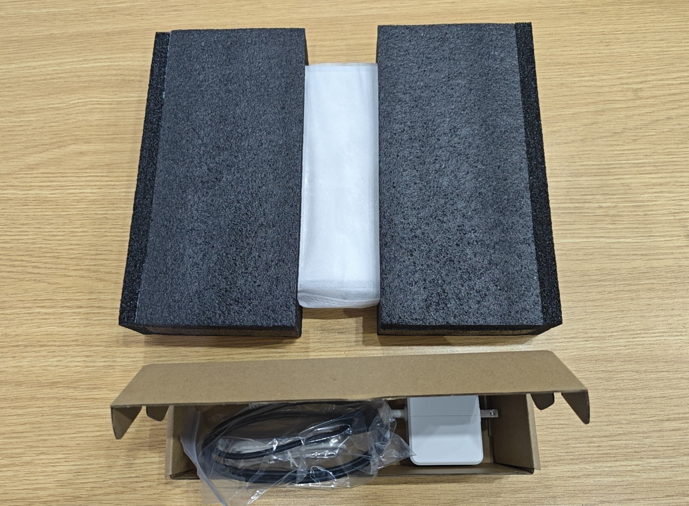
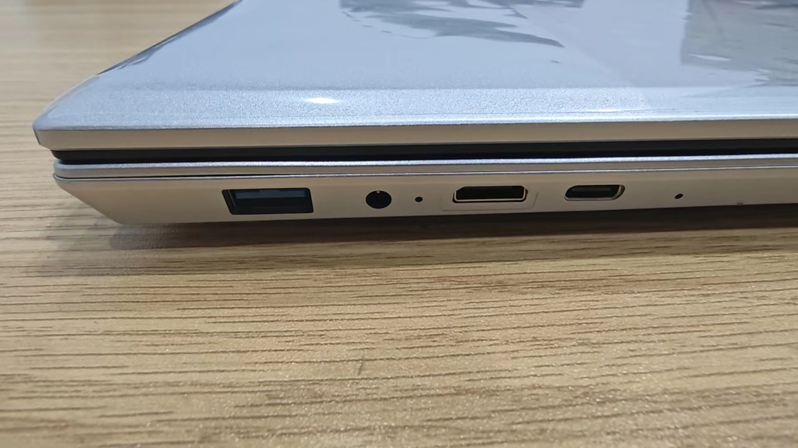
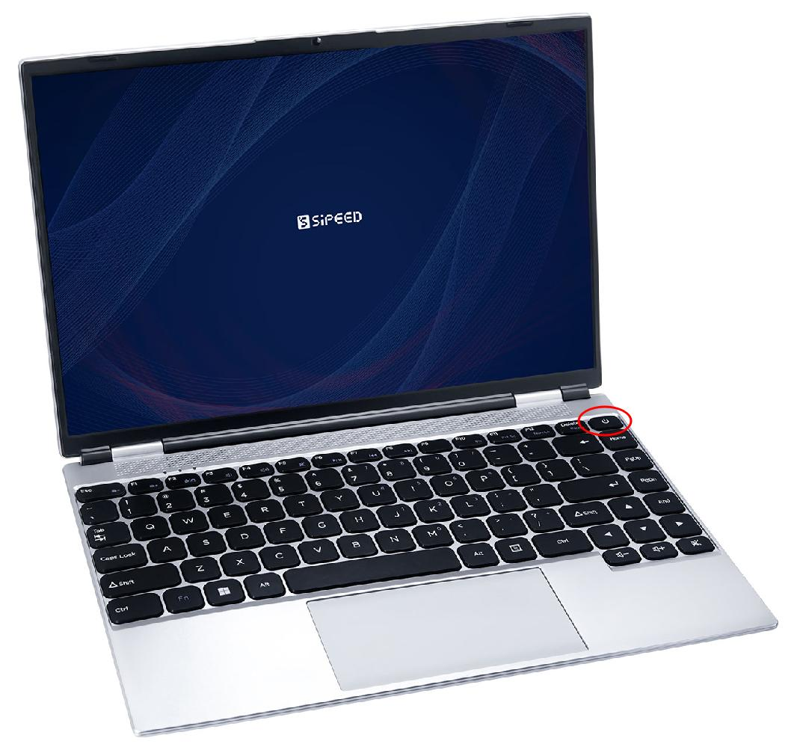
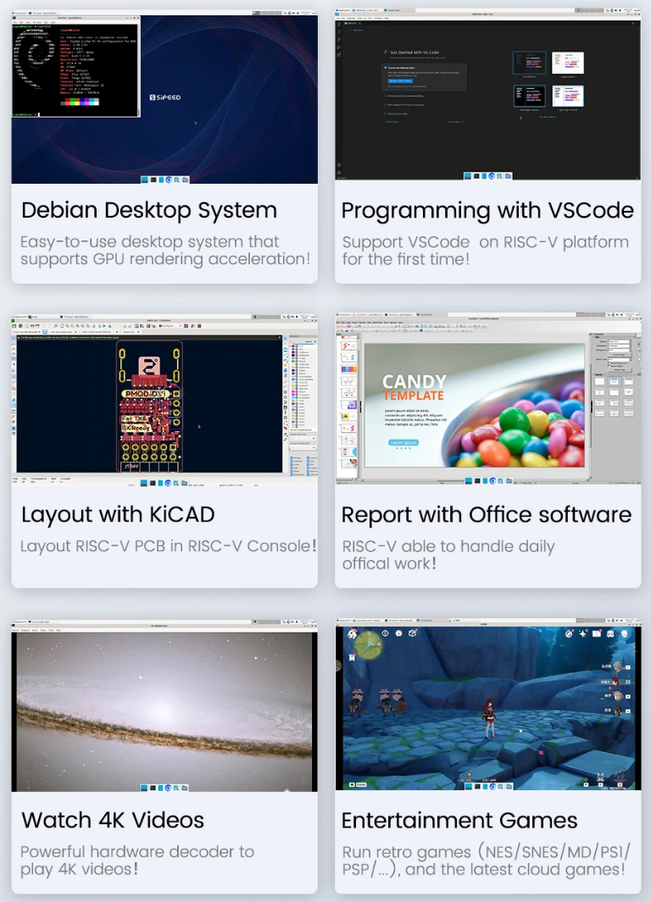
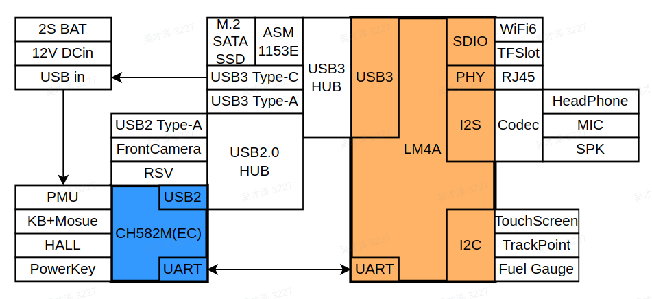

## 简介

Lichee Book 4A (以下简称 Book ) 是矽速科技研发的高性能 RISC-V 轻型笔电，旨在让RISC-V开发者提前体验RISC-V产品在实际生活中的开发应用。  
Lichee Book 4A 使用主流14inch笔电模具，集成了高性能RISC-V TH1520 SOM(8+32/16+128可选), 14寸1920x1200高清屏，88键圆帽静音键盘，以及USB-A，USB-C，2280 SSD卡槽，TF卡槽，miniHDMI，3.5mm耳机孔，等丰富接口，是具备开放性和使用性为一体 的RISCV笔记本～  
Lichee Book 4A 的软件支持也做到了较为完善的程度，默认搭载Debian操作系统，支持 Chrome浏览器，VSCode IDE，KiCAD PCB绘图软件，Office软件，4K播放器，多种游戏模拟器，基本满足日常工作学习使用。  
Lichee Book 4A 使用了模块化的设计方式，如果你之前购买了LicheePi4A，则可以复用SOM到Book上～ 
得益于模块化SOM设计，Lichee Book 4A 还能在将来通过更换模块的形式，升级到LM3A或者LM5A模块！


> 注意:高性能RISCV消费电子在当前(2024年)还是属于较为早期的阶段，Lichee Book 4A主要面向 RISC-V 开发者体验开发使用，至少要求熟练的Linux操作经验，普通消费者是无法直接上手使用的。
> 如果你是没有Linux经验的普通用户，请不要购买。


## 技术规格

<table>
<colgroup>
<col  class="org-left" />
<col  class="org-left" />
</colgroup>
<tr>
<td class="org-left">SOM</td>
<td class="org-left"> <a href="https://wiki.sipeed.com/lm4a">LM4A</a> </td>
</tr>
<tr>
<td class="org-left">CPU</td>
<td class="org-left"><strong>RISC-V RV64GCV C910@1.85GHz * 4</strong> </td>
</tr>
<tr>
<td class="org-left">GPU</td>
<td class="org-left">IMG™ B 系列 BXM-4-64 </td>
</tr>
<tr>
<td class="org-left">NPU</td>
<td class="org-left">4TOPS@INT8 </td>
</tr>
<tr>
<td class="org-left">Memory</td>
<td class="org-left"> 8GB or 16GB LPDDR4X </td>
</tr>
<tr>
<td class="org-left">Storage</td>
<td class="org-left"> 32GB or 128GB eMMC, NGFF 2280 SATA SSD </td>
</tr>
<tr>
<td class="org-left">Display</td>
<td class="org-left"> 14 inch 1920 x 1200 LCD, miniHDMI </td>
</tr>
<tr>
<td class="org-left">Inoput</td>
<td class="org-left"> 88-Keyboard, touchpad </td>
</tr>
<tr>
<td class="org-left">Camera</td>
<td class="org-left"> 0.3MP Front Camera </td>
</tr>
<tr>
<td class="org-left">Audio</td>
<td class="org-left"> 3.5mm Headphone, MEMS MIC, StereoSpeaker </td>
</tr>
<tr>
<td class="org-left">Network</td>
<td class="org-left"> WiFi6 + BT5.4 </td>
</tr>
<tr>
<td class="org-left">Interface</td>
<td class="org-left"> USB3.0 Type-A, USB3.0 Type-C, USB2.0 Type-A, MicroSD Slot </td>
</tr>
<tr>
<td class="org-left"> Battery </td>
<td class="org-left"> 4500 mAh@7.6V </td>
</tr>
<tr>
<td class="org-left">Case</td>
<td class="org-left"> Silver plastic Case</td>
</tr>
<tr>
<td class="org-left">Size & Weight</td>
<td class="org-left">314x217x17mm 1.3Kg</td>
</tr>
<tr>
<td class="org-left">System</td>
<td class="org-left">Debian </td>
</tr>
</table>


## 上手指南

### 开箱
收到货后的包装箱：


打开包装箱，取出两个部分，上面是笔记本本体，下面是12V2.5A电源适配器，和MiniHDMI线。



取出主机，顶面如图所示：


底面如图所示，可以看到一个SSD盖板，旋出螺丝即可安装SSD；以及底面中心是风扇吸风口，本机使用热管+静音风扇散热，保证核心凉爽温度。


侧面之一如图所示，接口从左到右依次为：TF卡，3.5mm耳机孔，USB2.0接口，电脑锁。


侧面之二如图所示，接口从左到右依次为：USB3.0口，12V DC口，miniHDMI口，USB-C口（兼顾下载/Host/充电）



（如果你购买的是准系统套餐，则需要先查看后面的“SOM安装指南”安装好LM4A后再进行下面操作。）
打开主机，长按右上角电源键3s开机（看到屏幕背光亮起 或者 左侧电源指示灯亮起 即可松开）



如果背光一直未亮起，可能是运输过程中电量耗尽，可以尝试插上电源适配器后长按电源开机。

开机背光亮起约15s后，屏幕左上角会开始闪烁光标（表示已经进入内核）
再经过约20s后，开始进入Debian桌面系统的登录界面。

输入帐号 sipeed，默认密码 licheepi，进入桌面系统后，你可以测试 触摸板，键盘，摄像头等 是否工作，如有发现不能工作的，可以与客服联系。  

默认系统为Debian，预装了 Chrome，Office， 等应用软件，你可以一一体验。  
你可以使用sudo apt instal xxx 来安装软件，默认用户名密码为 sipeed，licheepi  
其它一般性软件使用可以参考LicheePi4A的相关文档章节。  

### SSD使用指南
Book支持M.2 2280 SATA 接口的SSD，可以拆卸掉后壳的SSD盖板后安装


如果你不计划使用SSD，可以手工关闭USB转SSD芯片来降低功耗（约0.6Watt），提升续航：

进入/boot/dtbs/linux-image-5.10.113-zzz-sipeed-20240531+/thead/，找到对应使用的dtb进行修改，如8GB内存版本：  
sudo dtc -I dtb -O dts -o tmp.dts th1520-lpi4a-plastic.dtb  
编辑以下部分，将 enable-active-high; 改成 enable-active-low; 即可
```
	reg_sata_vcc_5v: regulator-sata-vcc-5v-en {
		status = "okay";
		compatible = "regulator-fixed";
		regulator-name = "regulator-sata-vcc-5v-en";
		regulator-min-microvolt = <5000000>;
		regulator-max-microvolt = <5000000>;
		vin-supply = <&reg_sys_vcc_5v>;
		gpio = <&pcal6408ahk_c 1 1>;
		enable-active-low;   
		regulator-always-on;
	};
```
sudo dtc -I dts -O dtb -o th1520-lpi4a-plastic.dtb tmp.dts   

然后重启即可关闭sata电源。


### SOM安装指南
如果你选购了准系统套餐，则需要安装SOM模块。  
需要自备十字螺丝刀，拆卸开后盖（需要先撕开两个脚垫，脚垫下面各有一个螺丝），安装好SOM模块，在CPU/DDR上方安装硅脂，放置热管，重新安装回后盖。


## 系统
Book的镜像与LConsole的镜像一同发布，仅uboot不同，建议使用8+32及以上配置的SOM。   
github仓库在： https://github.com/0x754C/sipeed-th1520-laptop-extra/releases
linux-image-*.deb 是sipeed提供的内核安装包，如果只想升级内核可以安装这个，安装前记得更新到对应版本的uboot，以及备份文件。  
sipeed-th1520-laptop-extra-*.deb 是sipeed提供的附加文件安装包，包括配置文件，测试工具，和EC固件。  
u-boot-with-spl-*.bin 是uboot文件，请选择你电路板对应型号的uboot进行烧写，烧写前记得备份文件，如果烧写错误的uboot可能会导致无法开机。  
boot|root-*.ext.xz 是分区镜像，如果想整个重新烧录，使用这个。  

百度网盘：
链接: https://pan.baidu.com/s/1jkJ4YR7EhMRZ11XmccKDtg   
提取码: qj1r   

Mega网盘：   
https://mega.nz/folder/p9BCTbLb#sWSZvLw6nrBmqujQXfvWrg   


常见应用展示：



Book 系统架构如下，细节可参照原理图或设备树文件。



## 资料下载
Lichee Book 4A 与 Lichee Console 4A 为相同主板，共享一份硬件资料：
[Sipeed 下载站](https://dl.sipeed.com/shareURL/LICHEE/LicheeConsole4A)


## 其他链接
[淘宝](https://item.taobao.com/item.htm?id=807162533118)
[Aliexpress](https://www.aliexpress.com/item/3256807018240741.html)  

QQ群: 559614960 [点我自动加群](http://qm.qq.com/cgi-bin/qm/qr?k=5YkapIhdtWHp8AEfM5_bFFYQIX3CUQN6)
Telegram: https://t.me/linux4rv

论坛：Maixhub.com/discussion
联系邮箱：support@sipeed.com


