## 概述

所有 Sipeed Tang 系列均有板载调试器（独立的 SOM 除外）。调试器是具有自己固件的独立 **MCU**。用户可以自行更新这些调试器的固件以获取功能更新和错误修复。

我们需要使用 [**BouffaloLabDevCube**](https://dev.bouffalolab.com/download/) 对这些板载调试器主控进行编程，有关 **博流MCU** 的 ***芯片 & 工具*** 的文档可以在此处找到 [【点我跳转】](https://dev.bouffalolab.com/document/)。

这里有一个简略的步骤说明：
- 首先，根据您所使用的操作系统，选择下载并安装相应版本的**更新工具**，如[**BouffaloLabDevCube**](https://dev.bouffalolab.com/download/)；
- 从 [**Sipeed 下载站**](https://dl.sipeed.com/shareURL/TANG/Debugger/onboard) 获取适用于您主板的更新调试器固件，请注意区分您的开发板的型号； 
- 请参阅 [**博流智能官方网站**](https://dev.bouffalolab.com/download/) 上相应的官方文档来更新板载调试器的固件；
- 对于 **Windows** 用户，下方有详细的分步骤教程。其他操作系统的用户请参考 **Windows** 的步骤并根据实际情况相应变通。

## 教程
  ### 硬件准备

  
  要将板载调试器置于 **DFU 模式**，请在打开电路板电源或使用电缆连接电路板的调试 USB 端口之前`按下` ***更新按钮*** 或`短接`相应的 ***测试点***。

  请参阅下文了解相应的 ***更新按钮*** 和 ***测试点***。

  #### **Tang nano 系列**

  - **Tang nano 1K**

    2 个 **`测试点`** 位于PCB的 **TOP** 面的左上角，按键`KEY-B` 后面。

    <!DOCTYPE html>
    <html lang="zh-CN">
    <head>
      <meta charset="UTF-8">
      <title>CSS Indentation</title>
      
    </head>
    <body>
      

        
点击此处查看nano 1K的下载器测试点的位置

        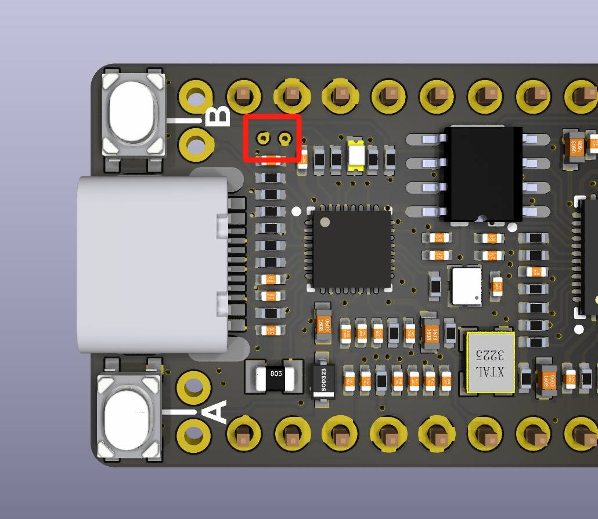
      

    </body>
     
    </html>

<!--  -->

  
- **Tang nano 4K**

  2 个 **`测试点`** 位于PCB的 **TOP** 面的左上角，`USB-C` 连接器后面。

  <!DOCTYPE html>
  <html lang="zh-CN">
  <head>
    <meta charset="UTF-8">
    <title>CSS Indentation</title>
    
  </head>
  <body>
    

      
点击此处查看nano 4K的下载器测试点的位置

      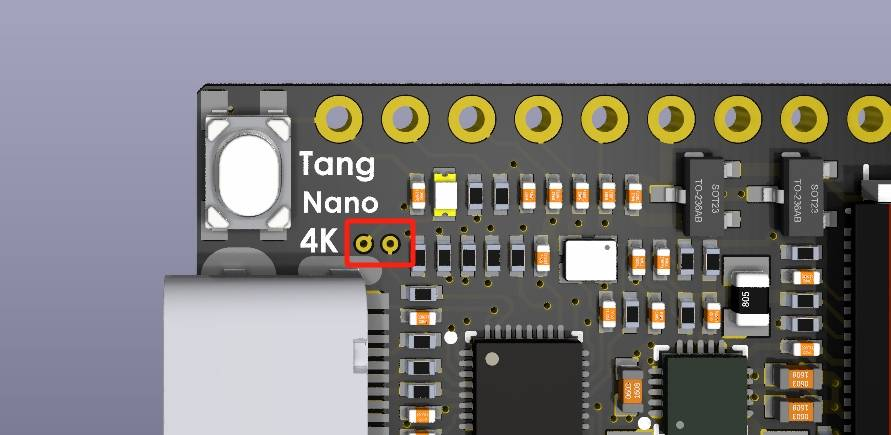
    

  </body>
   
  </html>

<!--  -->

- **Tang nano 9K**

  2 个 **`测试点`** 位于PCB的 **TOP** 面的中间左侧，`USB-C` 连接器后面。

  <!DOCTYPE html>
  <html lang="zh-CN">
  <head>
    <meta charset="UTF-8">
    <title>CSS Indentation</title>
    
  </head>
  <body>
    

      
点击此处查看nano 9K的下载器测试点的位置

      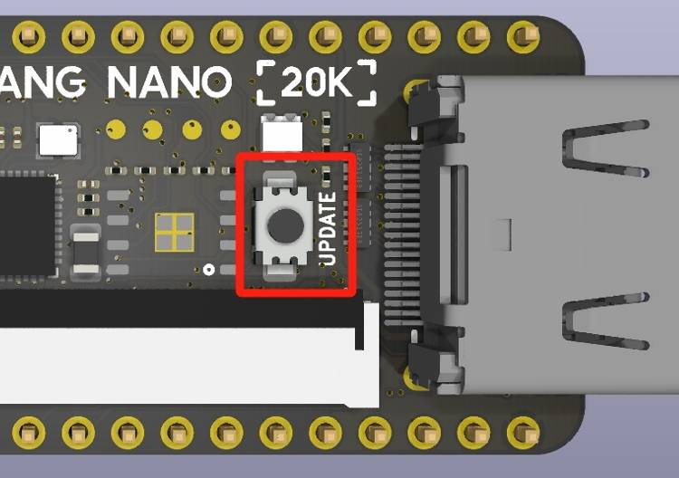
    

  </body>
   
  </html>
<!-- 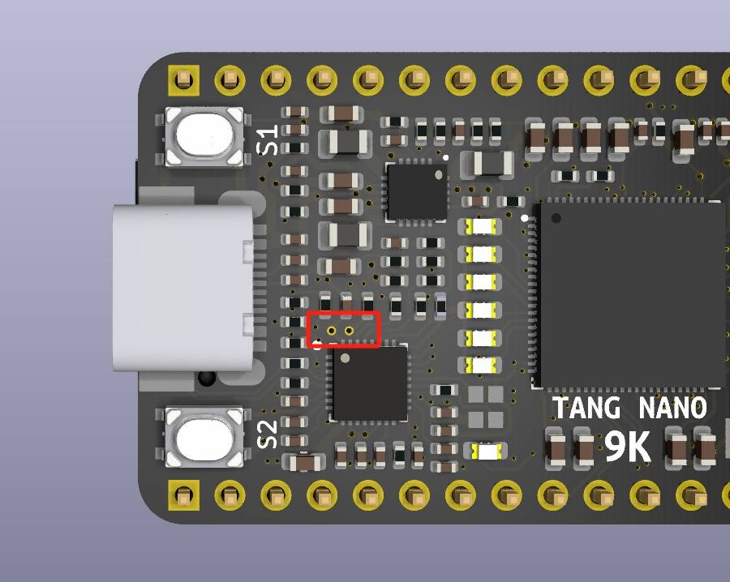 -->

- **Tang nano 20K**

  **`更新按钮`** 位于PCB的 **TOP** 面的 HDMI 连接器后面的，旁边有丝印 **`UPDATE`**。

  <!DOCTYPE html>
  <html lang="zh-CN">
  <head>
    <meta charset="UTF-8">
    <title>CSS Indentation</title>
    
  </head>
  <body>
    

      
点击此处查看nano 20K的下载器测更新按钮的位置

      
    

  </body>
   
  </html>

<!--  -->

  #### **Tang Primer 系列**

  - **Tang Primer 20K Dock**

    **`更新按钮`** 位于PCB的 **TOP** 面的 HDMI 连接器后面的，旁边有丝印 **`UPDATE`**。

    <!DOCTYPE html>
    <html lang="zh-CN">
    <head>
      <meta charset="UTF-8">
      <title>CSS Indentation</title>
      
    </head>
    <body>
      

        
点击此处查看Primer 20K Dock的下载器测更新按钮的位置

        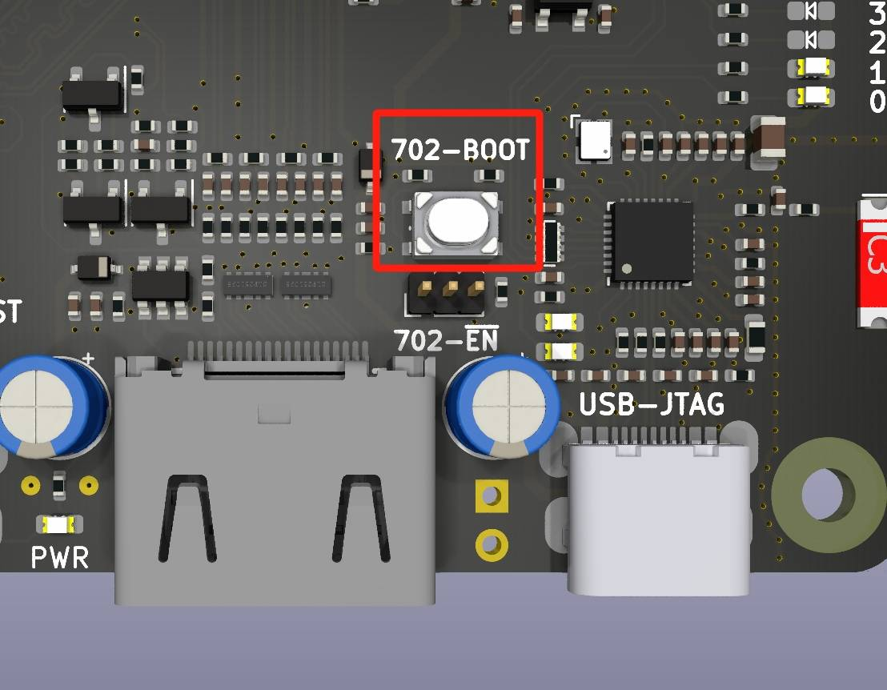
      

    </body>
     
    </html>
<!--  -->

  - **Tang Primer 25K Dock**

    2 个 **`测试点`** 位于PCB的 **BOT** 面的左上角，丝印标记为 `3V3` 和 `TDO`。

    <!DOCTYPE html>
    <html lang="zh-CN">
    <head>
      <meta charset="UTF-8">
      <title>CSS Indentation</title>
      
    </head>
    <body>
      

        
点击此处查看Primer 25K Dock的下载器测试点的位置

        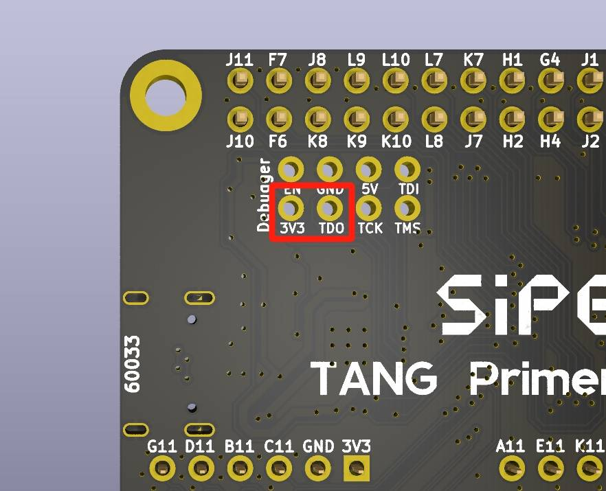
      

    </body>
     
    </html>
    
<!--  -->

  - ~~**Tang Primer 15K Dock**~~（尚未发布）

    ***TBD***

    <!DOCTYPE html>
    <html lang="zh-CN">
    <head>
      <meta charset="UTF-8">
      <title>CSS Indentation</title>
      
    </head>
    <body>
      

        
点击此处查看Primer 15K Dock的下载器测试点的位置

        
      

    </body>
     
    </html>
<!--  -->

  #### **Tang MEGA 系列**（包含Tang Console）

  - **Tang MEGA NEO Dock**（包含 Tang MEGA 138K Dock）

    **`更新按钮`** 位于 PCB 的 **TOP** 面 `USB-C` 连接器下方，丝印标记为 **DEBUG-USB2**。

    <!DOCTYPE html>
    <html lang="zh-CN">
    <head>
      <meta charset="UTF-8">
      <title>CSS Indentation</title>
      
    </head>
    <body>
      

        
点击此处查看MEGA NEO Dock的下载器测更新按钮的位置

        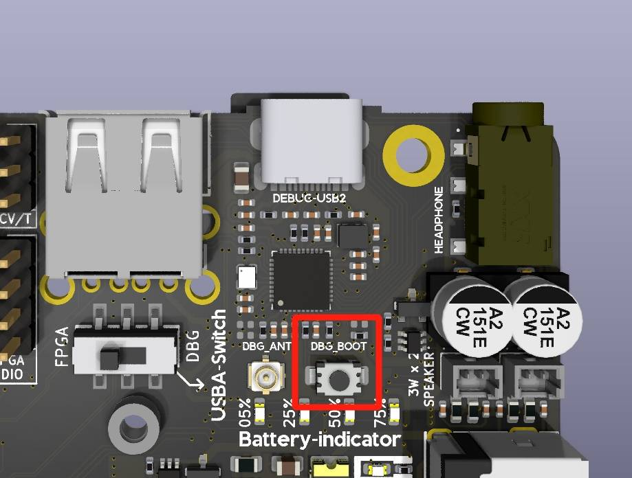
      

    </body>
     
    </html>

<!--  -->

  - **Tang MEGA 138K Pro Dock**

    **`更新按钮`** 位于 `USB-C` 连接器的左侧，在PCB的 **TOP** 面标记为 **JATG|UART**。

    <!DOCTYPE html>
    <html lang="zh-CN">
    <head>
      <meta charset="UTF-8">
      <title>CSS Indentation</title>
      
    </head>
    <body>
      

        
点击此处查看MEGA 138K Pro Dock的下载器更新按钮的位置

        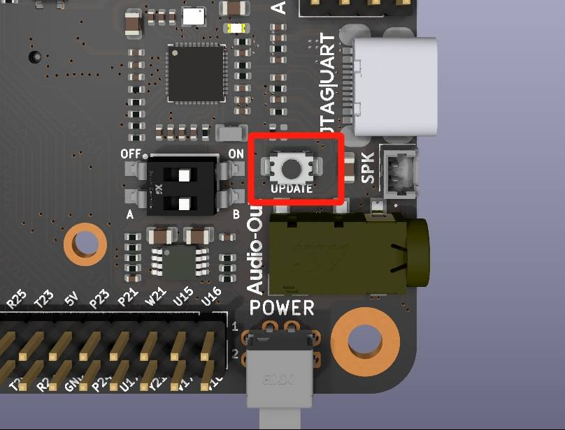
      

    </body>
     
    </html>

<!--  -->

  - **Tang Console**

    **`更新按钮`** 位于 `USB-C` 连接器的另一侧，在 PCB 的 **TOP** 面，是两个按钮中较矮的一个，丝印标记为 **`BOOT`**。

    <!DOCTYPE html>
    <html lang="zh-CN">
    <head>
      <meta charset="UTF-8">
      <title>CSS Indentation</title>
      
    </head>
    <body>
      

        
点击此处查看 Console 的下载器测试点的位置

        
      

    </body>
     
    </html>

<!--  -->

***

### 软件准备

- 首先从 [**BouffaloLab 官网**](https://dev.bouffalolab.com/download/) 下载 **BouffaloLabDevCube**，最新版本为 **`1.9.0`** (2025 年 2 月 10 日)

  

    
点击查看图片详情

      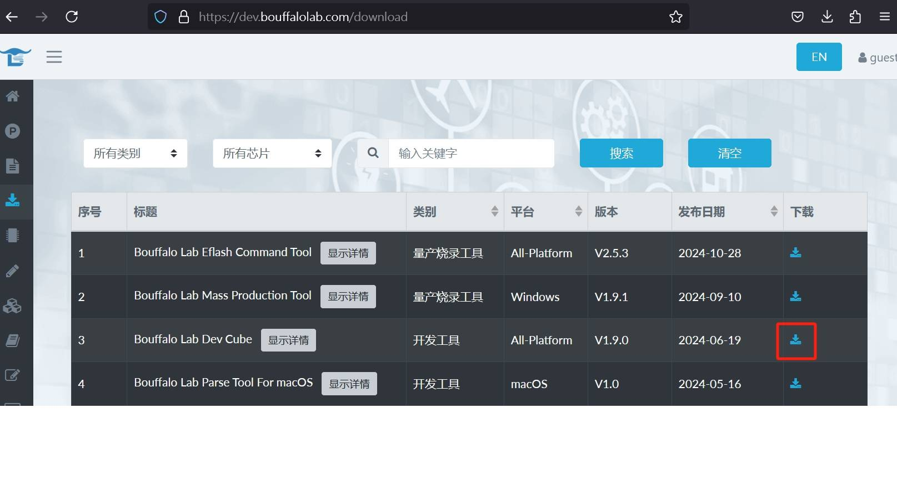
  

   

  
    <!--  -->

- 解压下载的内容，并执行相应的可执行文件，在 Windows 下是  **`BLDevCube.exe`**

  

    
点击查看图片详情

      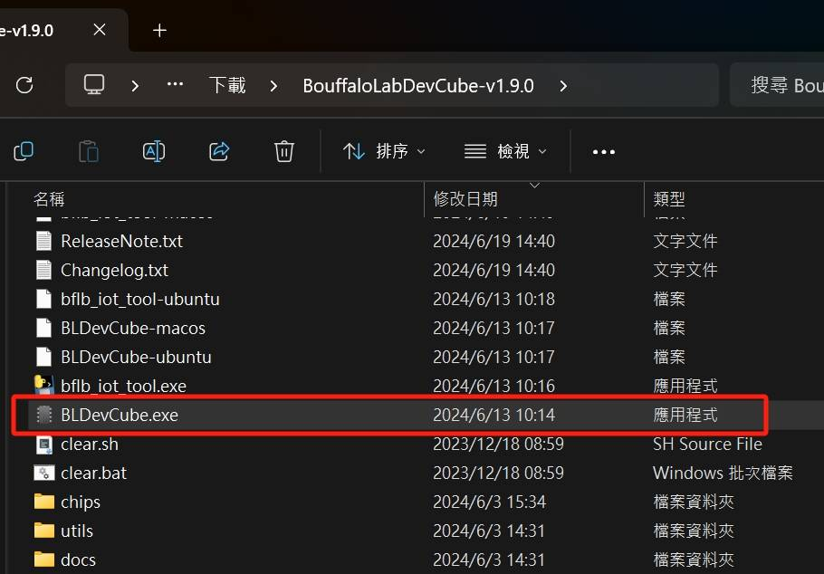
  

   

    <!--  -->

- 在弹出的窗口中，选择芯片型号为 BL616/618

  

    
点击查看图片详情

      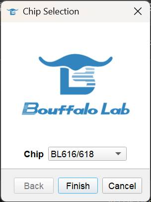
  

   

    <!--  -->

- 在新窗口中，选中 ***Single download option*** 下方的 **`Enable`** 复选框。单击 **`Browse`** 按钮选择要更新的固件档案

  

    
点击查看图片详情

      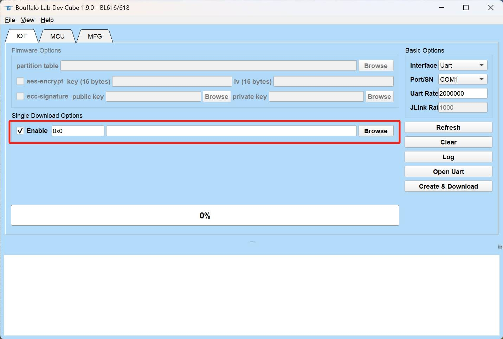
  

   

    <!--  -->

- 让板载调试器进入 **DFU模式**，它应该是 BL702 或 BL616 的 CDC-ACM 设备。在 Windows 上这会注册一个新的 COM 端口，在此示例中为 **`COM12`** 

    - 关于如何让板载调试器进入 **DFU模式**，请参考上一章节[【点我跳转】](#硬件准备)

    - 对于 Linux 用户，CDC-ACM 通常注册为 `/dev/ttyACMx` 
    
    - 对于 macOS 用户，它可能注册为 `/dev/tty.usbmodemxxxx` 或`/dev/cu.usbmodemxxxx`  （每个 `x` 代表一位数字）

  

    
点击查看图片详情

      
  

   

    <!--  -->
    

- 然后设置 **BLDevCube**，如下所示。设置固件档案位置、DFU 模式的端口，然后单击 **`Open UART`**，最后单击 **`Create & Download`**。

  

    
点击查看图片详情

      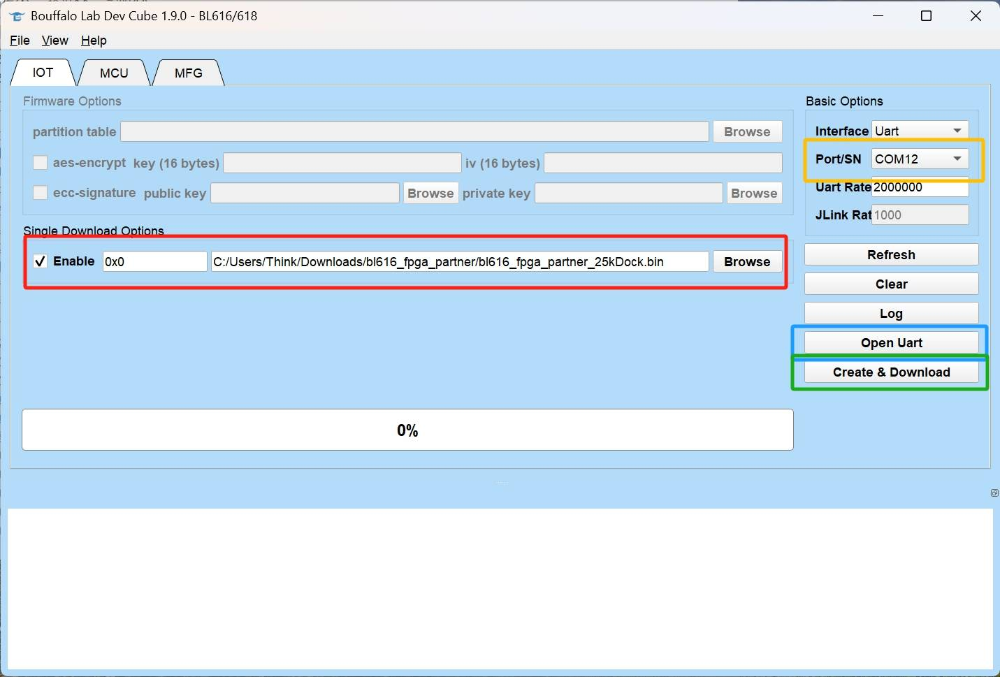
  

   
<!-- 
     -->

- 等待下载完成，如下图所示绿色进度条到100%，下方 **log** 提示 **`[All Success]`** 即为下载完成

  

    
点击查看图片详情

      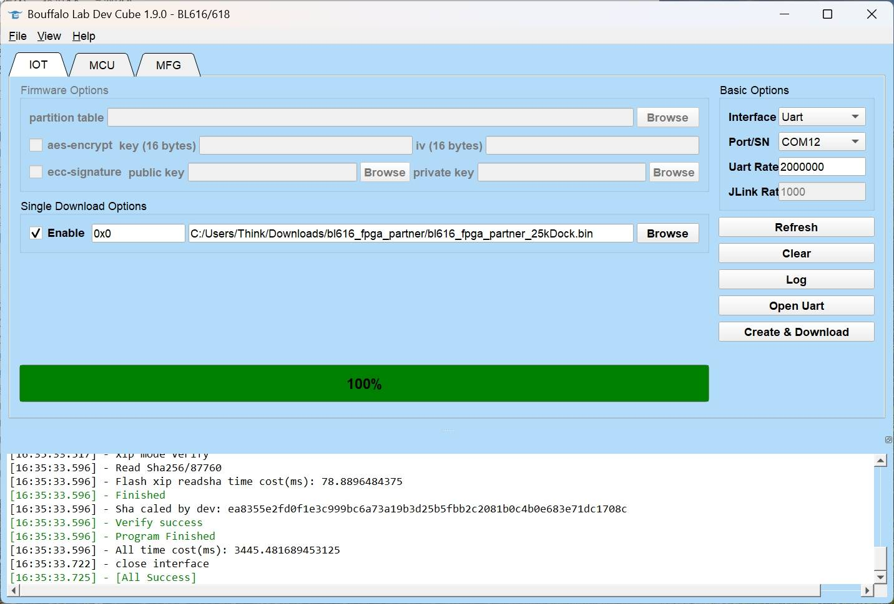
  

   

    <!--  -->

***

### 确认结果

完成以上步骤后，我们需要确认板载调试器的固件是否烧录成功。通常重新插拔 USB 线或重新给板子上电即可确认。

- 在 Windows 中，可以在设备管理器中看到两个新设备：**`USB Converter A`** 和 **`USB Converter B`**。

  

    
点击查看图片详情

      
  

   

<!--  -->

- 要确认调试器固件版本，请双击任意一个 **`USB Converter`**，然后转到“Details”选项卡。然后从下拉菜单中选择 **`父系`** 或 **`上层`** 选项：

  

    
点击查看图片详情

      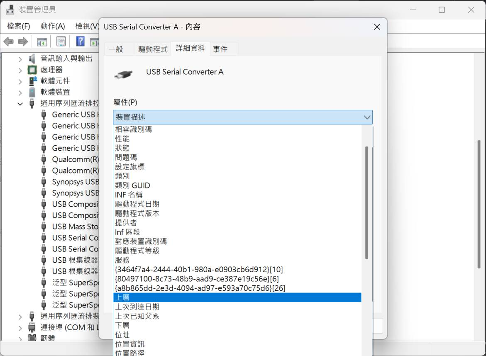
  

   

<!--  -->

- 如下图所示，最后 10 位数字 **`2025102315`** 是调试器固件版本的序列号。 Linux 和 macOS 用户可以使用命令 **`dmesg`** 检查内核日志中的序列号。

  

    
点击查看图片详情

      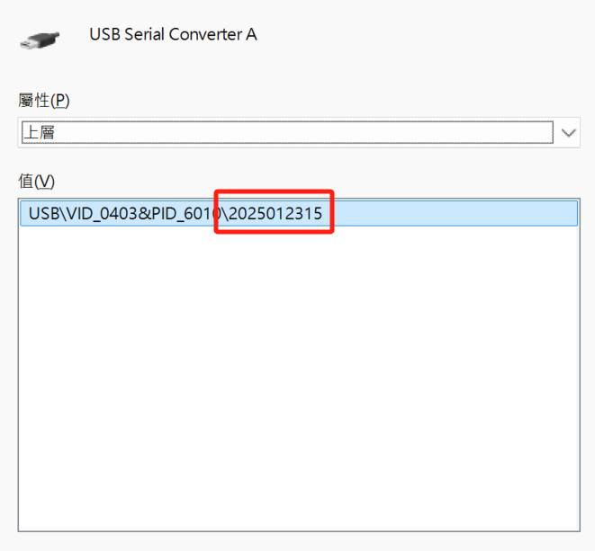
  

   
<!-- 
 -->

### 最新固件

所有Tang系列板载调试器的最新固件序列号记录在这里：

| 开发板型号         | MCU 型号  | 下载链接                                                                                                     |串号|  SHA256 杂凑/校验                                                                                                                     |
  | ------------- | ---------- | -------------------------------------------------------------------------------------------------------------| --------- |-----------------------------------------------------------------------------------------------------------------------------------------------|
  | nano 1K       | BL702      | N/A                                                                                                          | N/A       |N/A                                                                                                                                            |
  | nano 4K       | BL702      | N/A                                                                                                          | N/A       |N/A                                                                                                                                            |
  | Nano 9K       | BL702      | N/A                                                                                                          | N/A       |N/A                                                                                                                                            |
  | Primer 20K    | BL702      | N/A                                                                                                          | N/A       |N/A                                                                                                                                            |
  |               |            |                                                                                                              |           |                                                                                                                                               |
  | nano 20K      | BL616      | [点我](https://api.dl.sipeed.com/TANG/Debugger/onboard/BL616/202501231x/bl616_fpga_partner_20kNano.bin)     |2025012315 |[bl616_fpga_partner_20kNano.sha256](https://api.dl.sipeed.com/TANG/Debugger/onboard/BL616/202501231x/bl616_fpga_partner_20kNano.sha256)        |
  | Primer 25K    | BL616      | [点我](https://api.dl.sipeed.com/TANG/Debugger/onboard/BL616/202501231x/bl616_fpga_partner_25kDock.bin)     |2025012315 |[bl616_fpga_partner_25kDock.sha256](https://api.dl.sipeed.com/TANG/Debugger/onboard/BL616/202501231x/bl616_fpga_partner_25kDock.sha256)        |
  | Mega NEO      | BL616      | [点我](https://api.dl.sipeed.com/TANG/Debugger/onboard/BL616/202501231x/bl616_fpga_partner_NeoDock.bin)     |2025012315 |[bl616_fpga_partner_NeoDock.sha256](https://api.dl.sipeed.com/TANG/Debugger/onboard/BL616/202501231x/bl616_fpga_partner_NeoDock.sha256)        |
  | Mega 138K Pro | BL616      | [点我](https://api.dl.sipeed.com/TANG/Debugger/onboard/BL616/202501231x/bl616_fpga_partner_138kproDock.bin) |2025012315 |[bl616_fpga_partner_138kproDock.sha256](https://api.dl.sipeed.com/TANG/Debugger/onboard/BL616/202501231x/bl616_fpga_partner_138kproDock.sha256)|
  | Console       | BL616      | [点我](https://api.dl.sipeed.com/TANG/Debugger/onboard/BL616/202501231x/bl616_fpga_partner_Console.bin)     |2025012319 |[bl616_fpga_partner_Console.sha256](https://api.dl.sipeed.com/TANG/Debugger/onboard/BL616/202501231x/bl616_fpga_partner_Console.sha256)        |

### 故障排除
如果您在使用过程中遇到任何问题，或者对文档有任何意见或建议，请随时向我们反馈。联系方式如下。

- **交流论坛: [maixhub.com/discussion](https://maixhub.com/discussion)**
- **QQ 交流群：[834585530](https://jq.qq.com/?_wv=1027&k=wBb8XUan)**
- **Telegram** : [t.me/sipeed](t.me/sipeed)
- **Reddit** : [reddit.com/r/GowinFPGA/](reddit.com/r/GowinFPGA/)
- 商业邮箱 : [support@sipeed.com](support@sipeed.com)
- 直接本页下方留言

>在大多数情况下，对于MCU相关的问题 ***博流智能*** 的官方文档足以进行故障排除。[【点击这里】](https://dev.bouffalolab.com/document/)以访问相关文档。

#### 常见问题
- TBD，等待收集反馈后再添加。

